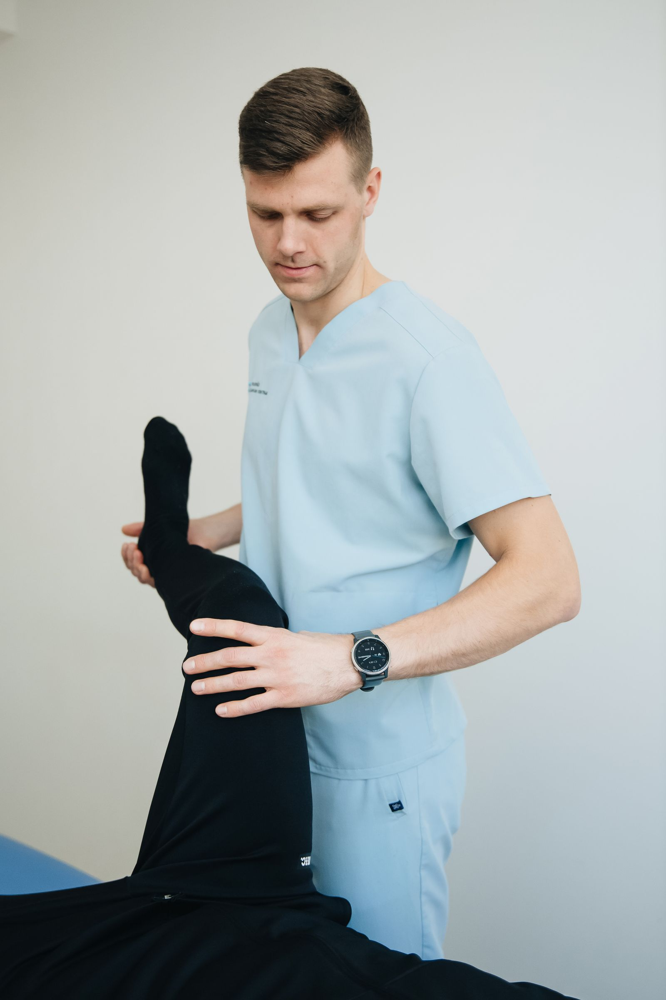

Mobilidade articular é a capacidade de uma articulação se movimentar em toda a sua amplitude, com controle. Diferente do alongamento passivo, os exercícios de mobilidade combinam movimento ativo e força, e por isso costumam trazer benefícios mais duradouros para quem passa boa parte do dia sentado ou em posições repetitivas.

Separei uma rotina curta, que pode ser feita em casa, sem equipamentos, em cerca de 8 a 10 minutos.

## 1. Rotação torácica em quadrupedia

Apoie mãos e joelhos no chão. Leve uma mão até a nuca e gire o tronco, levando o cotovelo em direção ao teto, acompanhando o olhar. Retorne e repita do outro lado.

- 2 séries de 8 repetições para cada lado.
- Ajuda a destravar a coluna torácica, frequentemente rígida em quem trabalha sentado.

## 2. Mobilidade de quadril "90/90"

Sentado no chão, dobre as duas pernas formando um ângulo de aproximadamente 90 graus, uma para cada lado. Alterne a rotação do quadril de um lado para o outro, mantendo o tronco ereto.

- 2 séries de 6 repetições para cada lado.
- Excelente para quadris travados por excesso de tempo sentado.

## 3. Agachamento com pausa

Faça um agachamento controlado e, no ponto mais baixo confortável, faça uma pausa de 2 a 3 segundos antes de subir.

- 3 séries de 8 repetições.
- Trabalha mobilidade de tornozelo, joelho e quadril ao mesmo tempo.

## 4. Gato-camelo

Na posição de quadrupedia, alterne entre arquear a coluna para cima (como um gato assustado) e para baixo, abrindo o peito.

- 2 séries de 10 repetições, em movimento lento e controlado.
- Um clássico para aliviar tensão na lombar após longos períodos sentado.

## 5. Passada com rotação (world's greatest stretch)

Dê um passo largo à frente, mantenha o joelho de trás quase no chão e gire o tronco para o lado da perna da frente, levando o braço para cima.

- 2 séries de 5 repetições para cada lado.
- Mobiliza quadril, coluna torácica e cadeia posterior em um único movimento.

## Como encaixar na rotina

O ideal é fazer essa sequência pela manhã, antes de começar o dia, ou como pausa ativa a cada 2-3 horas de trabalho sentado. Não é necessário sentir dor para que o exercício seja eficaz — o objetivo é ganhar amplitude com controle, não forçar o limite.

---

_Se você sente dor ao realizar algum desses movimentos, interrompa e procure uma avaliação fisioterapêutica antes de continuar. Este conteúdo é educativo e não substitui orientação profissional individualizada._
