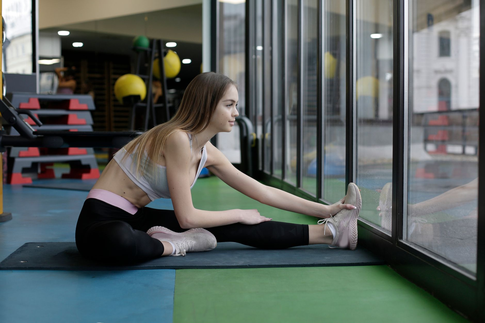

É uma das dúvidas mais comuns em qualquer consultório de fisioterapia: alongar antes ou depois do treino? A resposta curta é "depende do tipo de alongamento e do objetivo", mas entender essa diferença muda completamente a forma como você prepara o corpo para se exercitar.

## Os dois tipos de alongamento

Existem, basicamente, duas categorias relevantes para quem treina:

- **Alongamento dinâmico**: movimentos controlados e progressivos, sem manter a posição por muito tempo — como balançar a perna ou girar os braços. Ele ativa a musculatura e prepara as articulações para o movimento.
- **Alongamento estático**: manter uma posição de alongamento por um período (geralmente 20 a 40 segundos), buscando ganho de amplitude. Ele relaxa a musculatura e reduz a tensão acumulada.

Confundir essas duas categorias é a origem da maior parte das dúvidas sobre "quando alongar".

## Antes do treino: priorize o dinâmico

Alongamentos estáticos muito prolongados antes de um esforço intenso podem reduzir temporariamente a capacidade de geração de força muscular, o que não é ideal antes de atividades que exigem potência, como corrida, musculação com carga ou esportes de explosão.

Por isso, antes do treino, a recomendação costuma ser priorizar o alongamento dinâmico e um aquecimento progressivo, que aumenta a temperatura muscular e a mobilidade articular sem comprometer o desempenho.

## Depois do treino: espaço para o estático

Após o treino, o cenário muda. Com a musculatura já aquecida e sem a exigência imediata de força máxima, o alongamento estático se torna uma ferramenta útil para:

1. Reduzir a sensação de tensão muscular acumulada.
2. Trabalhar ganho de amplitude de movimento a médio prazo, quando feito de forma regular.
3. Servir como um momento de transição e relaxamento entre o esforço físico e o restante do dia.

## E quando o objetivo é só ganhar flexibilidade?

Se a meta principal não é o desempenho no treino em si, mas sim melhorar a flexibilidade ao longo do tempo (por exemplo, para alcançar posições específicas em uma modalidade), o alongamento estático pode — e deve — ser trabalhado em momentos dedicados, fora do aquecimento, com frequência regular e progressão gradual de tempo e intensidade.

---

_Essas orientações são gerais e educativas. A rotina ideal de alongamento varia de pessoa para pessoa, e um fisioterapeuta pode ajustá-la conforme seu histórico e seus objetivos._
