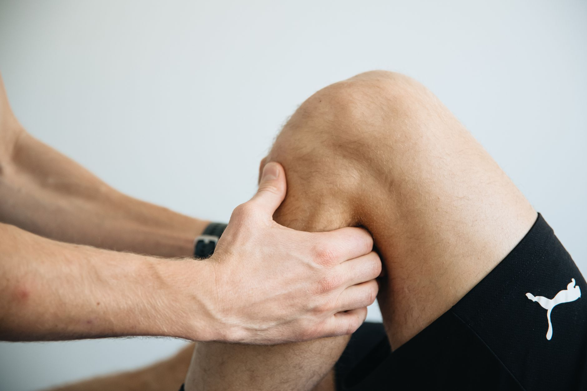

A dor na frente do joelho é uma das queixas mais comuns entre corredores, tão frequente que ganhou o apelido de "joelho do corredor". Na maioria dos casos, ela está relacionada à síndrome da dor patelofemoral, um quadro que costuma responder muito bem à fisioterapia quando identificado a tempo.

## O que causa a dor patelofemoral

A síndrome patelofemoral acontece quando a patela não desliza de forma equilibrada dentro do sulco do fêmur durante o movimento, gerando atrito e irritação na cartilagem e nos tecidos ao redor. Isso costuma estar associado a:

- **Fraqueza do quadríceps e dos músculos do quadril**, especialmente do glúteo médio, que ajuda a estabilizar o joelho durante a corrida.
- **Progressão de treino muito rápida**, aumentando volume ou intensidade sem dar tempo de adaptação aos tecidos.
- **Desequilíbrios biomecânicos**, como pisada muito pronada ou falta de mobilidade de tornozelo e quadril.

## Como identificar o quadro

A dor costuma aparecer na região anterior do joelho, ao redor ou atrás da patela, e piora em atividades que exigem flexão da articulação sob carga: descer escadas, agachar ou correr em descidas. Muitas vezes ela surge de forma gradual, não a partir de um único episódio de trauma, o que faz com que muitos corredores só procurem ajuda quando o quadro já está mais avançado.

## Tratamento fisioterapêutico

O tratamento costuma focar no fortalecimento do quadríceps e da musculatura do quadril, junto de um trabalho de controle motor para melhorar o alinhamento do joelho durante a corrida. Em muitos casos, um ajuste temporário no volume de treino é necessário para permitir que os tecidos se recuperem enquanto a musculatura é fortalecida.

A análise da técnica de corrida também pode ajudar a identificar padrões que sobrecarregam o joelho, como passadas muito longas ou cadência baixa.

## Prevenção para quem já corre sem dor

Corredores sem sintomas também se beneficiam de um trabalho preventivo: fortalecimento regular do quadril e do quadríceps, progressão gradual de volume (evitando aumentos acima de 10% por semana) e atenção ao surgimento de qualquer desconforto persistente no joelho, tratando-o antes que se torne uma lesão instalada.

---

_Este conteúdo tem fins educativos. Dor persistente no joelho durante a corrida deve ser avaliada por um fisioterapeuta antes de se tornar um quadro crônico._
