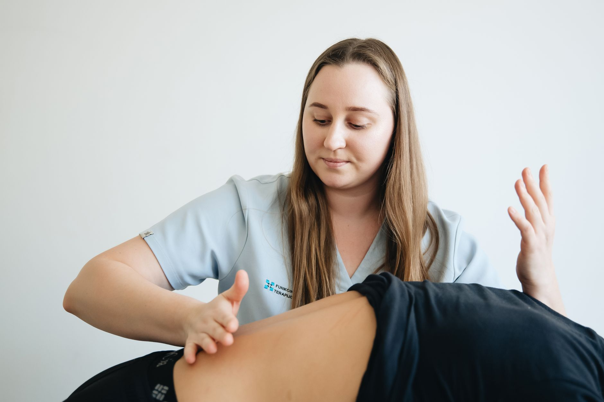

Muita gente que sente dor na parte mais baixa das costas, próxima ao glúteo, associa o incômodo automaticamente à lombar. Mas nem toda dor nessa região vem da coluna propriamente dita — em uma parcela relevante dos casos, a origem está na articulação sacroilíaca, a conexão entre o osso sacro e o osso ilíaco da bacia. Por ser menos conhecida, essa causa costuma demorar mais para ser identificada corretamente.

## O que é a articulação sacroilíaca

A articulação sacroilíaca fica de cada lado da base da coluna, unindo o sacro à pelve. Ela tem pouca amplitude de movimento, mas cumpre um papel importante: transmitir e absorver as cargas entre o tronco e os membros inferiores a cada passo, cada troca de posição e cada esforço do dia a dia. Quando essa articulação se torna instável ou passa a se mover de forma inadequada, o resultado costuma ser dor localizada e sensação de sobrecarga na região.

## Como diferenciar da dor lombar comum

Alguns sinais ajudam a levantar a suspeita de origem sacroilíaca:

- Dor concentrada de um lado, geralmente próxima a uma "covinha" na base das costas, em vez de espalhada por toda a lombar.
- Piora ao ficar muito tempo sentado, ao subir escadas, ao virar na cama ou ao ficar de pé apoiado em uma perna só.
- Sensação de instabilidade ou de que o quadril "sai do lugar", sem que isso realmente aconteça.
- Ausência do padrão de irradiação característico da ciática, embora a dor às vezes se estenda até a parte de trás da coxa.

Como esses sintomas podem se sobrepor a outras causas de dor lombar, a avaliação clínica — que inclui testes específicos de mobilidade e provocação da articulação — é o que realmente confirma o diagnóstico.

## Causas e fatores de risco

A disfunção sacroilíaca pode surgir por diferentes motivos, entre eles:

1. **Alterações na forma de caminhar ou de distribuir o peso**, muitas vezes compensando dor em outra articulação, como joelho ou quadril.
2. **Frouxidão ligamentar**, mais comum durante a gravidez, quando hormônios preparam o corpo para o parto e deixam a articulação mais móvel do que o habitual.
3. **Impacto ou torção súbita**, como uma queda ou um movimento brusco ao levantar peso de forma assimétrica.
4. **Assimetrias posturais mantidas por longos períodos**, como sentar sempre com o peso mais em um lado do corpo.

## Como a fisioterapia trata

O tratamento costuma combinar diferentes abordagens, ajustadas conforme a fase e a causa identificada:

**Controle da dor e da inflamação local**, nas fases mais agudas, com recursos que permitam retomar o movimento o quanto antes.

**Estabilização ativa**, com exercícios voltados para a musculatura profunda do tronco, do quadril e do assoalho pélvico — que ajudam a articulação a ganhar suporte e reduzir a instabilidade.

**Terapia manual**, incluindo mobilizações específicas da região, que costuma trazer alívio relativamente rápido em muitos casos.

**Correção de padrões de movimento**, observando como a pessoa caminha, se levanta e distribui o peso, para eliminar sobrecargas repetitivas sobre a articulação.

Na maioria dos casos, a dor sacroilíaca responde bem ao tratamento conservador, sem necessidade de procedimentos invasivos. O ponto-chave é reconhecer que a origem do problema pode não estar onde a dor é sentida com mais intensidade, e por isso uma avaliação completa da coluna, do quadril e da forma de se movimentar faz toda a diferença.

---

*As informações deste artigo têm caráter geral e não substituem uma consulta com um profissional de fisioterapia, que poderá identificar a causa real do seu quadro e indicar a conduta mais adequada.*
