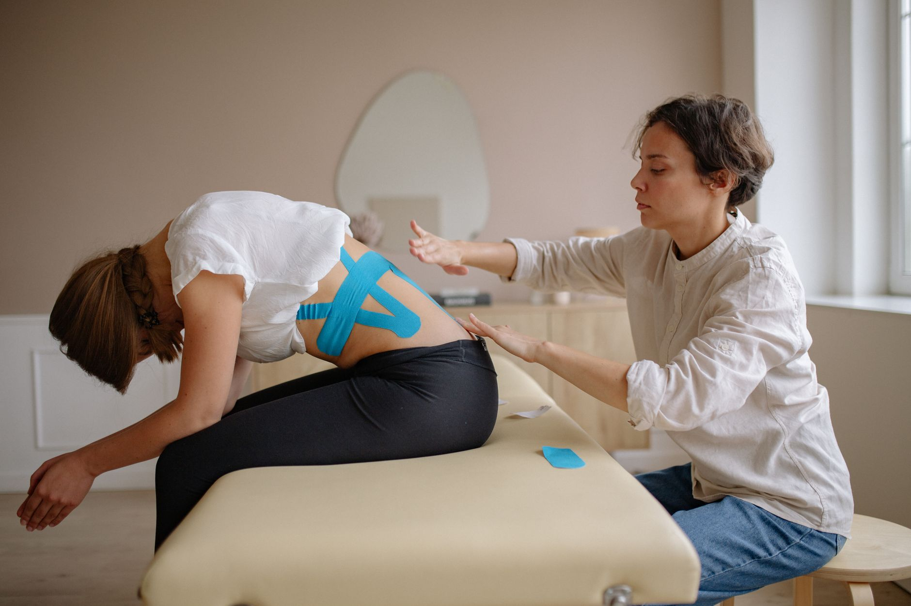

A entorse de tornozelo é uma das lesões mais comuns na prática esportiva — e também uma das mais subestimadas. É comum a pessoa "torcer o pé", esperar a dor passar em alguns dias e voltar à atividade sem completar a reabilitação. O problema é que essa lesão, quando mal tratada, tem uma taxa alta de recidiva.

## O que fazer nas primeiras horas

Nas primeiras 48 a 72 horas após a entorse, o cuidado costuma seguir alguns princípios simples: proteger a articulação de novos estresses, evitar repouso absoluto (movimento controlado é melhor que imobilidade total), aplicar gelo por períodos curtos para ajudar no controle da dor e do inchaço, e manter o tornozelo elevado quando possível. Uma avaliação fisioterapêutica logo nesse início ajuda a dimensionar a gravidade da lesão e orientar os próximos passos.

## Por que "esperar passar" não é suficiente

Grande parte das entorses melhora a dor em poucos dias, o que leva muitas pessoas a considerarem o problema resolvido. Mas a dor sumir não significa que os ligamentos recuperaram a estabilidade, nem que a propriocepção — a capacidade do corpo de perceber a posição da articulação no espaço — voltou ao normal.

Sem esse trabalho, o tornozelo fica mais vulnerável a uma nova entorse, muitas vezes em situações banais do dia a dia, não apenas durante o esporte.

## As etapas da reabilitação completa

Uma reabilitação bem conduzida costuma passar por:

1. **Controle da dor e do inchaço** na fase aguda.
2. **Recuperação da amplitude de movimento**, evitando rigidez articular.
3. **Fortalecimento muscular** ao redor do tornozelo, especialmente dos músculos fibulares.
4. **Treino de propriocepção e equilíbrio**, em superfícies estáveis e depois instáveis.
5. **Retorno gradual à atividade**, incluindo exercícios específicos do esporte praticado.

Pular as duas últimas etapas é o erro mais comum — e o principal motivo de entorses recorrentes.

## Quando desconfiar de algo mais sério

Dor muito intensa, incapacidade de apoiar o pé no chão ou inchaço volumoso e persistente são sinais de que a entorse pode ser mais grave, envolvendo ruptura ligamentar completa ou até fratura, e merecem avaliação médica e fisioterapêutica o quanto antes.

---

_Este artigo é educativo e não substitui uma avaliação individual. Cada entorse tem sua própria gravidade, que só um profissional pode determinar após examinar o tornozelo._
