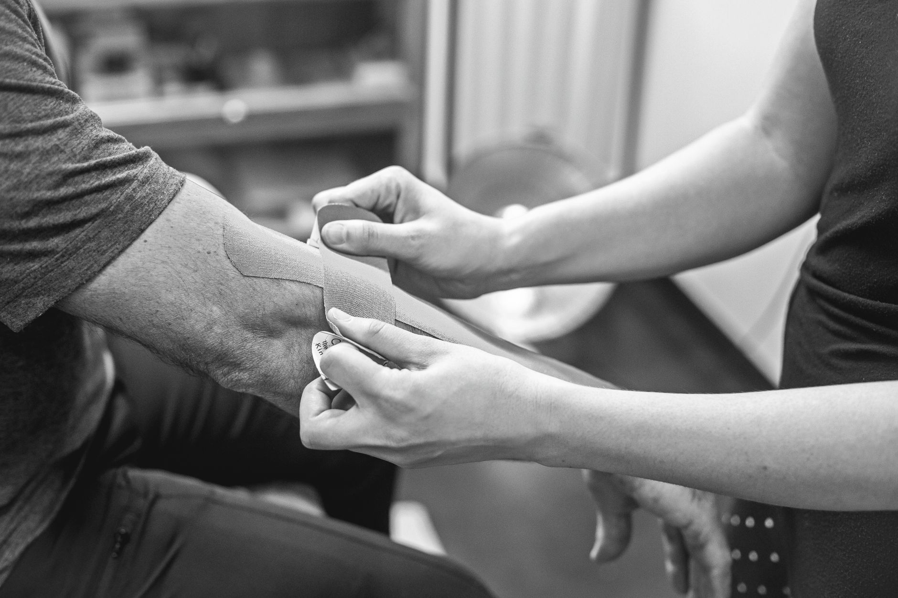

Apesar do nome popular, a maioria das pessoas com "cotovelo de tenista" nunca pegou uma raquete. A epicondilite lateral é uma lesão por sobrecarga dos tendões que se inserem na parte externa do cotovelo, e aparece com muito mais frequência em quem trabalha com movimentos repetitivos de mão e punho do que em atletas.

## O que causa a sobrecarga

Os músculos extensores do punho e dos dedos se originam numa saliência óssea na parte externa do cotovelo (o epicôndilo lateral). Movimentos repetitivos de extensão e rotação do punho — digitar, usar mouse, apertar parafusos, carregar sacolas com a palma para baixo — geram microlesões nesse tendão ao longo do tempo. Diferente de uma lesão aguda, a epicondilite costuma se instalar de forma gradual, começando como um desconforto leve que só aparece em certos movimentos.

## Sintomas que ajudam a identificar

- Dor na parte externa do cotovelo, que pode irradiar para o antebraço.
- Piora ao segurar objetos com o punho estendido — apertar a mão de alguém, levantar uma xícara, girar uma maçaneta.
- Fraqueza de preensão, mesmo sem dor intensa em repouso.
- Sensibilidade ao toque direto sobre o epicôndilo.

## Por que não é só "deixar descansar"

Repouso total costuma aliviar a dor temporariamente, mas sozinho não resolve — o tendão continua com a mesma fragilidade quando o movimento é retomado, e o quadro tende a voltar. O tratamento fisioterapêutico combina controle da dor na fase inicial com fortalecimento excêntrico do tendão (contrações controladas enquanto ele se alonga), que é hoje a abordagem com melhor resposta para recondicionar esse tecido.

## Ajustes que reduzem a recidiva

Além dos exercícios, costuma valer a pena revisar o gesto que gerou a sobrecarga: altura do mouse e teclado, técnica de uso de ferramentas manuais, ou a técnica de golpe em quem realmente joga tênis ou padel. Um cotovelo tratado sem ajuste do gatilho original tem chance real de voltar a doer assim que a rotina de esforço se repete.

## Quando procurar avaliação

Vale buscar acompanhamento se a dor persistir por mais de uma ou duas semanas, se limitar tarefas simples do dia a dia, ou se a força de preensão estiver visivelmente reduzida. Quanto antes o tratamento começa, mais rápida costuma ser a resposta — quadros muito arrastados tendem a levar mais tempo para recondicionar.

---

_Este conteúdo é educativo e não substitui avaliação individual. Cada caso de epicondilite tem um gatilho diferente, e identificá-lo é parte do tratamento._
