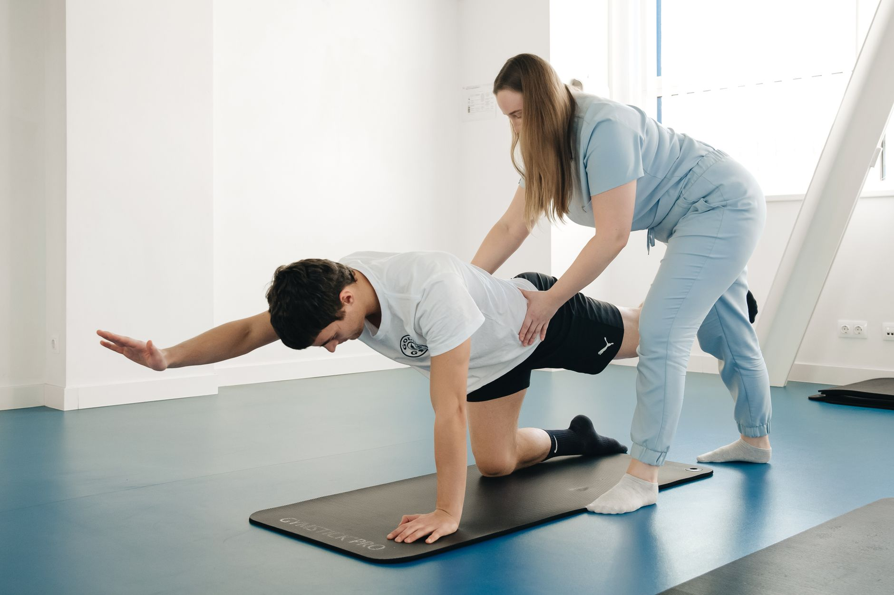

Escoliose é o nome dado a uma curvatura lateral da coluna, geralmente acompanhada de certo grau de rotação das vértebras. É mais comum do que se imagina — a maioria dos casos é leve e descoberta ainda na adolescência, muitas vezes em exames de rotina ou avaliações posturais na escola.

## Nem toda escoliose é igual

O grau da curvatura, medido em graus através de um exame de imagem específico, é o principal fator que direciona a conduta. Curvaturas leves costumam apenas ser acompanhadas ao longo do tempo. Curvaturas moderadas geralmente são candidatas ao tratamento conservador, incluindo fisioterapia especializada e, em alguns casos, uso de colete. Curvaturas mais acentuadas, especialmente em fase de crescimento rápido, podem exigir avaliação ortopédica mais próxima.

Por isso, o primeiro passo sempre é a avaliação médica, que define a gravidade e orienta se — e como — a fisioterapia deve entrar no cuidado.

## O papel da fisioterapia no tratamento

Diferente do que muita gente pensa, o objetivo da fisioterapia não é "endireitar" a coluna — mudanças estruturais na curvatura têm limites biológicos claros. O foco real é:

- **Estabilizar a progressão da curva**, especialmente em fases de crescimento, através de exercícios específicos de fortalecimento assimétrico.
- **Melhorar a consciência postural**, ajudando a pessoa a reconhecer e corrigir ativamente compensações no dia a dia.
- **Reduzir desconfortos associados**, como tensão muscular e dor, comuns em curvaturas mais acentuadas.
- **Otimizar a função respiratória**, em casos onde a curvatura interfere na mecânica da caixa torácica.

Alguns protocolos específicos, como o método Schroth, são amplamente utilizados nesse contexto por trabalharem exercícios assimétricos direcionados ao padrão específico de cada curva.

## O que esperar do acompanhamento

O tratamento de escoliose costuma ser um processo de médio e longo prazo, com reavaliações periódicas — muitas vezes acompanhando o crescimento, no caso de adolescentes, ou o conforto funcional, no caso de adultos com escoliose já estabelecida. Resultados não aparecem de uma sessão para outra: consistência na realização dos exercícios prescritos é o fator que mais influencia o resultado ao longo do tempo.

## Na fase adulta, a escoliose também importa

É comum pensar que escoliose é "coisa de adolescente", mas curvaturas antigas podem gerar desconforto e sobrecarga assimétrica com o passar dos anos. Nesses casos, a fisioterapia atua mais focada em alívio de sintomas, fortalecimento e manutenção da função do que em controle de progressão, já que a coluna já atingiu a maturidade esquelética.

## Sinais que merecem avaliação

Alguns sinais ajudam pais e cuidadores a identificar precocemente uma possível escoliose em crianças e adolescentes:

- **Ombros ou omoplatas em alturas diferentes**, visíveis ao observar as costas da criança em pé.
- **Um lado do quadril aparentemente mais elevado** que o outro.
- **Assimetria ao curvar o tronco para frente**, com uma das costelas ou da região lombar se projetando mais de um lado.
- **Roupas que não "caem" de forma simétrica no corpo**, um sinal indireto, mas frequentemente notado pelos próprios pais.

Nenhum desses sinais confirma o diagnóstico isoladamente, mas justificam uma avaliação com ortopedista ou fisioterapeuta especializado.

## Perguntas frequentes

**Exercício físico piora a escoliose?** Não. Pelo contrário, a atividade física bem orientada faz parte do próprio tratamento. O mito de que esportes de alto impacto pioram a curvatura não tem respaldo consistente na literatura atual.

**Colete corrige a escoliose?** O colete tem como objetivo frear a progressão da curva durante a fase de crescimento, não corrigi-la de forma definitiva. Seu uso é decidido pelo ortopedista com base no grau da curvatura e na maturidade óssea.

**Escoliose leve precisa de acompanhamento contínuo?** Sim, ao menos durante a fase de crescimento, já que curvas leves podem progredir. Reavaliações periódicas ajudam a identificar cedo qualquer mudança que exija ajuste de conduta.

## O papel da família no acompanhamento

Quando o diagnóstico acontece na infância ou adolescência, o envolvimento da família faz bastante diferença no resultado do tratamento. Isso inclui acompanhar a consistência com que os exercícios são realizados em casa, observar mudanças posturais ao longo do tempo entre uma consulta e outra, e ajudar o adolescente a manter a adesão ao colete, quando prescrito, já que o tempo de uso diário recomendado costuma ser desafiador de cumprir integralmente nessa fase da vida. Um ambiente de apoio, sem cobranças excessivas, tende a favorecer tanto a adesão ao tratamento quanto o bem-estar emocional do jovem em relação à própria condição.

## Escoliose funcional: quando a causa não é estrutural

Vale diferenciar a escoliose estrutural, discutida ao longo deste texto, de uma curvatura funcional ou postural, que pode surgir de forma secundária a uma discrepância de comprimento entre as pernas, a um desequilíbrio muscular ou até a uma dor que faz a pessoa assumir uma postura compensatória. Nesses casos, a curvatura tende a desaparecer ou reduzir significativamente quando a causa de base é corrigida, diferente da escoliose estrutural, que mantém a rotação vertebral mesmo com a correção da postura.

---

_Este conteúdo tem propósito educativo. A avaliação e o acompanhamento da escoliose devem sempre envolver profissionais de saúde qualificados, de forma individualizada._
