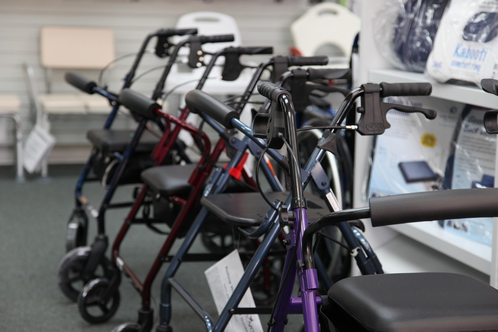

Descobrir, em um exame de imagem, que uma vértebra está "deslizada" costuma causar bastante apreensão. O termo técnico é espondilolistese, e apesar de soar grave, boa parte dos casos é estável, convive bem com atividade física e responde de forma consistente ao tratamento conservador. Entender o que está por trás do diagnóstico ajuda a substituir o medo por um plano de ação.

## O que é a espondilolistese

A espondilolistese acontece quando uma vértebra escorrega para frente (ou, mais raramente, para trás) em relação à vértebra logo abaixo dela, geralmente na região lombar baixa. O grau desse deslizamento é medido em porcentagem, e a maioria dos casos identificados em adultos é discreta, sem instabilidade importante. Ela pode ter origem em uma fratura de estresse em uma pequena parte do osso vertebral, mais comum em adolescentes que praticam esportes com hiperextensão repetida da coluna, ou em um desgaste degenerativo das articulações e dos discos, mais típico depois dos 50 anos.

## Por que nem toda espondilolistese dói

Um dado que costuma surpreender é que muitas pessoas têm espondilolistese em exames de imagem sem nunca ter sentido dor por causa dela. O sintoma surge quando o deslizamento passa a irritar estruturas próximas, como as raízes nervosas, ou quando a musculatura ao redor não consegue mais compensar a instabilidade local, gerando sobrecarga mecânica. Por isso, o grau de deslizamento na imagem nem sempre corresponde à intensidade da dor: uma pessoa com um deslizamento pequeno pode sentir bastante desconforto, enquanto outra com um grau maior pode ser praticamente assintomática.

## Como a fisioterapia atua no tratamento

O objetivo central do tratamento conservador é aumentar a estabilidade da coluna sem depender apenas da estrutura óssea, e isso é construído por algumas frentes principais:

**Estabilização segmentar**, com exercícios que ativam a musculatura profunda do abdômen e da lombar, criando um "cinturão" muscular que sustenta a região do deslizamento.

**Fortalecimento progressivo de glúteos e core**, reduzindo a demanda sobre a própria coluna durante atividades do dia a dia e da prática esportiva.

**Orientação de movimento**, ensinando a pessoa a evitar posições de hiperextensão excessiva da lombar durante exercícios ou tarefas cotidianas, que tendem a aumentar o estresse sobre o segmento afetado.

**Progressão funcional gradual**, retomando atividades físicas e esportivas de forma controlada, conforme a estabilidade e a força evoluem.

Na grande maioria dos casos, esse conjunto de medidas é suficiente para controlar a dor e permitir uma vida ativa, sem necessidade de cirurgia.

## Quando vale investigar mais a fundo

Sinais como dor que se irradia para uma ou ambas as pernas com formigamento ou fraqueza, piora progressiva mesmo com tratamento adequado, ou qualquer alteração no controle da bexiga ou do intestino merecem avaliação médica sem demora. Fora dessas situações, a espondilolistese costuma ser um diagnóstico para conviver com tranquilidade, mantendo a coluna forte e ativa em vez de evitada por receio.

---

*Este texto tem objetivo educativo e não substitui uma avaliação individualizada, já que o grau de deslizamento, a idade e o nível de atividade de cada pessoa mudam completamente a conduta mais indicada.*
