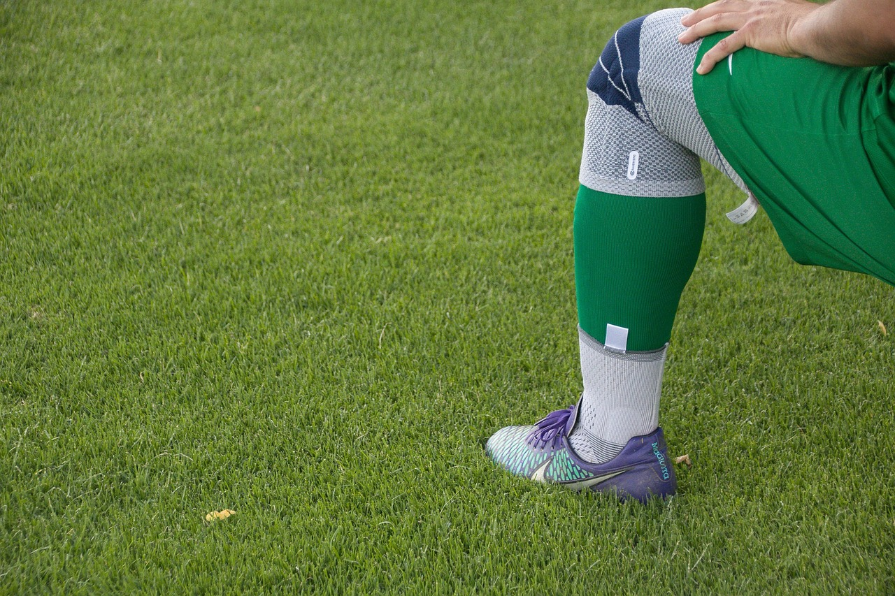

Uma dor em fisgada na sola do pé, bem embaixo do calcanhar, logo nos primeiros passos ao sair da cama — essa é a queixa clássica de quem tem fascite plantar. É uma das causas mais comuns de dor no pé, atingindo tanto corredores que aumentaram o volume de treino quanto pessoas que passam longas horas em pé no trabalho.

## O que é a fascite plantar

A fáscia plantar é uma faixa espessa de tecido que liga o calcanhar aos dedos, sustentando o arco do pé e absorvendo impacto a cada passo. Quando essa estrutura recebe carga repetitiva além do que consegue tolerar, surgem pequenas lesões e um processo inflamatório na região onde ela se insere no osso do calcanhar. É esse ponto, especificamente, que costuma doer mais.

## Por que a dor piora pela manhã

Durante o sono, a fáscia plantar fica em posição encurtada, sem a tração do peso do corpo. Ao dar os primeiros passos do dia, ela é subitamente esticada, o que provoca a dor aguda característica. Depois de alguns minutos de movimento, a fáscia se alonga gradualmente e o desconforto tende a diminuir — para retornar mais tarde, após períodos prolongados em pé ou ao final de uma corrida.

## Fatores de risco

Alguns elementos aumentam a chance de desenvolver o quadro:

- **Aumento brusco de volume ou intensidade de treino**, especialmente em corredores.
- **Calçados inadequados ou muito desgastados**, sem amortecimento ou suporte de arco suficiente.
- **Longos períodos em pé sobre superfícies duras**, comuns em profissões como área da saúde, comércio e indústria.
- **Encurtamento da panturrilha e mobilidade reduzida do tornozelo**, que sobrecarregam a fáscia a cada passo.
- **Sobrepeso e alterações no formato do arco plantar**, tanto pé muito plano quanto muito cavo.

## Como a fisioterapia trata

O tratamento é conservador na grande maioria dos casos e costuma reunir diferentes frentes:

**Controle da dor e da inflamação**, com recursos que reduzem o processo agudo e permitem retomar a rotina com menos desconforto.

**Alongamento direcionado**, da fáscia plantar e da musculatura da panturrilha, que costuma ser o ponto de maior impacto na melhora dos sintomas.

**Fortalecimento da musculatura intrínseca do pé**, melhorando a capacidade de absorver carga sem sobrecarregar sempre o mesmo ponto.

**Orientação sobre calçados e progressão de carga**, principalmente para quem corre ou passa muitas horas em pé, evitando que o quadro volte a se instalar depois de resolvido.

A fascite plantar tende a responder bem ao tratamento, mas costuma levar semanas para ceder por completo — é um processo que exige constância mais do que pressa. Insistir em treinar ou permanecer em pé ignorando a dor tende a prolongar a recuperação, por isso identificar o problema cedo e ajustar a carga desde o início faz toda a diferença.

## O papel do calçado na recuperação

Trocar o calçado inadequado costuma ser uma das medidas com efeito mais perceptível no dia a dia de quem tem fascite plantar. Um tênis com bom amortecimento no calcanhar e suporte adequado ao formato do arco plantar reduz a carga repetitiva sobre a fáscia a cada passo, enquanto andar descalço ou com chinelos sem sustentação — hábito comum dentro de casa — tende a manter a irritação ativa mesmo com o tratamento em andamento. Para quem sente dor mesmo em repouso dentro de casa, um calçado com suporte, usado mesmo em ambientes internos durante a fase aguda, costuma fazer diferença real na velocidade de recuperação.

## Palmilhas e o uso de talas noturnas

Em casos que demoram mais para responder, dois recursos complementares costumam entrar no plano de tratamento. As palmilhas, personalizadas ou pré-fabricadas, ajudam a redistribuir a carga sobre o pé e reduzir a tração excessiva sobre a fáscia durante a caminhada. Já as talas noturnas mantêm o [tornozelo](/blog/mobilidade-de-tornozelo/) em uma posição que evita o encurtamento da fáscia durante o sono, reduzindo a intensidade daquela dor característica dos primeiros passos pela manhã. Nenhum dos dois recursos substitui o fortalecimento e o alongamento, mas podem acelerar a resposta ao tratamento em quadros mais persistentes.

## Perguntas frequentes

**Fascite plantar tem cura ou só controle?** A grande maioria dos casos se resolve por completo com o tratamento adequado, embora leve algumas semanas de constância. Recidivas costumam acontecer quando os fatores de risco de origem — calçado inadequado, encurtamento de panturrilha — não são corrigidos.

**Posso continuar correndo com fascite plantar?** Depende da intensidade da dor. Em quadros leves, reduzir volume e ajustar o calçado costuma ser suficiente; em dor mais intensa, um período de substituição temporária por atividades de baixo impacto acelera a recuperação.

**Esporão de calcâneo é a mesma coisa que fascite plantar?** Não, embora frequentemente coexistam. O esporão é uma calcificação óssea, muitas vezes achado incidental em exames, enquanto a dor costuma vir da inflamação da fáscia ao redor dele, não do esporão em si.

**Leia também:** [Canelite: Por que Aparece em Corredores e Como Tratar](/blog/canelite-sindrome-estresse-tibial-medial/) e [Fisioterapia após ruptura do tendão de Aquiles](/blog/fisioterapia-ruptura-tendao-de-aquiles/).

---

*As informações deste artigo têm caráter geral e não substituem uma consulta com um profissional de fisioterapia, que poderá identificar a causa real do seu quadro e indicar a conduta mais adequada.*
