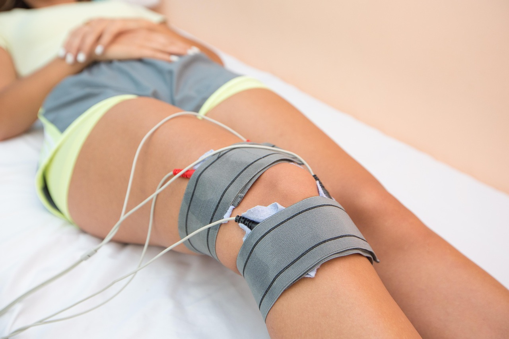

A colocação de uma prótese de quadril costuma ser indicada quando o desgaste da articulação — por artrose avançada, fratura ou outras condições — já compromete de forma importante a mobilidade e a qualidade de vida. A cirurgia resolve o problema estrutural da articulação, mas é a fisioterapia que devolve à pessoa a capacidade de caminhar, subir escadas e realizar tarefas simples com confiança.

## As primeiras semanas: mobilização e proteção da prótese

Logo após a cirurgia, o corpo ainda está se adaptando à nova articulação, e o trabalho fisioterapêutico começa dentro de limites bem definidos pela equipe ortopédica. Nessa fase inicial, os cuidados costumam incluir:

- Orientação sobre movimentos e posições a evitar, para proteger a prótese enquanto os tecidos ao redor cicatrizam.
- Exercícios leves de ativação muscular do quadril, joelho e tornozelo, para não perder força enquanto a mobilidade ainda é limitada.
- Treino de transferências — sair da cama, sentar, levantar — com técnica correta para reduzir o risco de sobrecarga na articulação nova.

## Reaprendendo a caminhar

Um dos marcos mais esperados da reabilitação é a volta à marcha independente. O processo costuma ser gradual: primeiro com apoio de andador ou muletas, depois reduzindo progressivamente esse suporte conforme a força e o equilíbrio melhoram. O fisioterapeuta observa detalhes da forma de caminhar — como o comprimento do passo e a distribuição de peso entre as pernas — para corrigir compensações antes que elas se tornem hábito.

## Fortalecimento: a base da estabilidade a longo prazo

Depois que a marcha básica está reestabelecida, o foco passa para o fortalecimento dos músculos ao redor do quadril, especialmente os glúteos, responsáveis por estabilizar a bacia durante a caminhada. Um quadril bem fortalecido reduz a sobrecarga sobre a prótese e melhora o desempenho em atividades do dia a dia, como subir escadas ou levantar de uma cadeira baixa.

## Quando esperar a volta às atividades normais

O ritmo de recuperação varia bastante de pessoa para pessoa, dependendo da técnica cirúrgica usada, da condição física prévia e da resposta individual ao tratamento. Muitos pacientes retomam atividades básicas em poucas semanas, mas o fortalecimento completo e a retomada de atividades mais exigentes costumam levar alguns meses. Manter a constância nas sessões de fisioterapia, mesmo quando a dor já melhorou, é o que garante que o resultado da cirurgia se traduza em ganho real de função.

---

_As orientações deste artigo são gerais e não substituem o acompanhamento de um fisioterapeuta, que ajusta o ritmo da reabilitação conforme a cirurgia realizada e a evolução de cada paciente._
