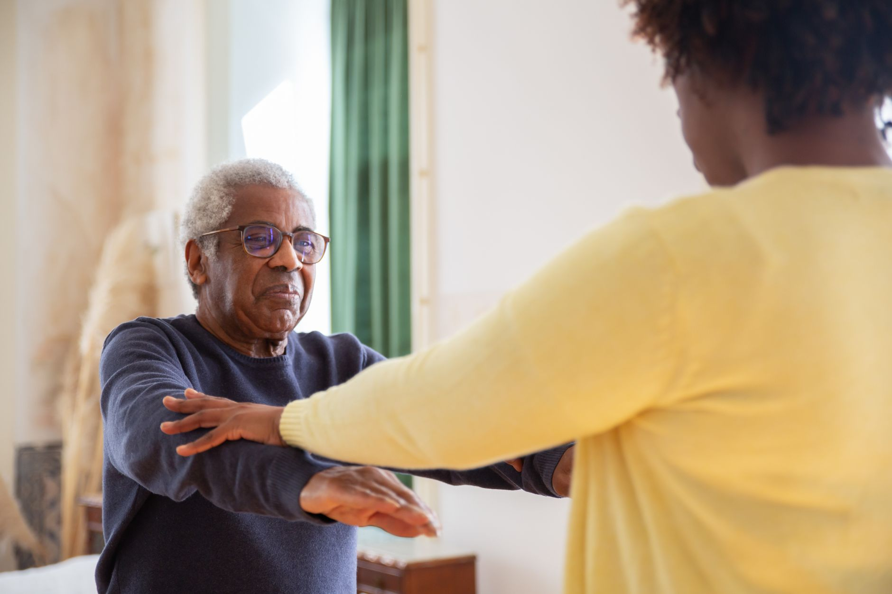

Quedas na terceira idade não acontecem por acaso. Na maioria das vezes, elas são resultado de mudanças graduais — perda de força muscular, redução do equilíbrio, diminuição da mobilidade articular — que vão se acumulando ao longo dos anos, muitas vezes sem sintomas evidentes até o dia em que resultam em um acidente.

## Por que o risco de queda aumenta com a idade

A partir dos 60 anos, é natural que ocorra uma perda progressiva de massa muscular, processo conhecido como sarcopenia, que afeta principalmente os membros inferiores. Some-se a isso a redução da propriocepção — a capacidade do corpo de perceber sua posição no espaço — e o resultado é um equilíbrio mais instável, especialmente em superfícies irregulares ou pouco iluminadas.

Além disso, muitas pessoas idosas reduzem naturalmente o nível de atividade física por precaução, o que paradoxalmente acelera a perda de força e piora o equilíbrio a longo prazo.

## O que o trabalho fisioterapêutico envolve

A avaliação inicial identifica os principais pontos de fragilidade: força de membros inferiores, amplitude de movimento de quadril e tornozelo, e a qualidade do equilíbrio estático e dinâmico. A partir disso, o programa costuma incluir:

1. **Fortalecimento muscular progressivo**, com ênfase em quadríceps, glúteos e musculatura estabilizadora do tornozelo.
2. **Treino de equilíbrio**, com exercícios que desafiam a estabilidade de forma segura e gradual.
3. **Treino funcional**, reproduzindo situações do dia a dia, como levantar de uma cadeira ou subir um degrau.

## Benefícios que vão além da prevenção de quedas

Pacientes que mantêm um acompanhamento fisioterapêutico regular na terceira idade relatam mais confiança para realizar atividades do cotidiano, maior disposição e menos dependência de terceiros para tarefas simples. A prevenção de quedas é um dos resultados mais visíveis, mas o ganho de autonomia é, muitas vezes, o que mais impacta a qualidade de vida.

## Nunca é cedo nem tarde para começar

Não é preciso esperar a primeira queda para procurar acompanhamento. Um programa de fortalecimento e equilíbrio bem orientado pode começar em qualquer fase, com exercícios adaptados à condição física de cada pessoa.

---

_Este texto tem caráter informativo. Cada pessoa idosa tem um histórico de saúde particular, por isso o acompanhamento deve ser individualizado por um fisioterapeuta._
