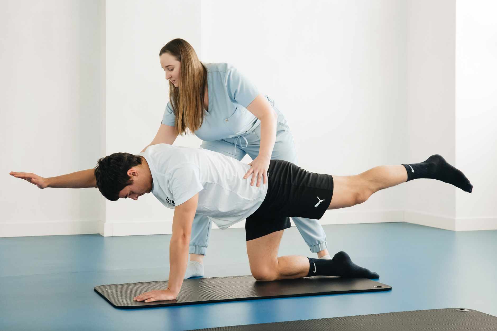

O termo "core" costuma ser associado a abdômen definido, mas na fisioterapia ele tem um significado bem mais amplo — e muito mais relevante para a saúde da coluna do que a estética. O core é o conjunto de músculos que estabiliza o tronco, e é ele quem sustenta a coluna em praticamente todos os movimentos do dia a dia.

## O que realmente compõe o core

Diferente do que muita gente imagina, o core não é só o abdômen visível. Ele inclui o transverso do abdômen (a camada muscular mais profunda), a musculatura lombar, o assoalho pélvico e o diafragma. Juntos, esses músculos formam uma espécie de cinturão natural que estabiliza a coluna antes mesmo de qualquer movimento dos braços ou das pernas acontecer.

Quando esse cinturão está enfraquecido, a coluna passa a receber uma carga que deveria ser distribuída entre vários grupos musculares, aumentando o risco de dor lombar e compensações posturais.

## Por que ele protege a coluna

Em qualquer movimento — levantar um objeto, girar o tronco, caminhar, correr — o core se ativa primeiro, estabilizando a coluna antes que o movimento principal aconteça. Se essa ativação é fraca ou tardia, a coluna fica mais exposta, e estruturas como discos intervertebrais e articulações passam a sofrer uma sobrecarga que não deveriam receber.

## Como fortalecer com segurança

Fortalecer o core não significa necessariamente fazer abdominais em grande quantidade — muitos exercícios abdominais tradicionais, inclusive, sobrecarregam a lombar quando mal executados. Uma progressão seguindo orientação fisioterapêutica costuma incluir:

- **Exercícios de ativação**, como a prancha isométrica, que trabalham a estabilização sem movimento excessivo da coluna.
- **Exercícios de controle motor**, que ensinam o corpo a ativar o core de forma automática durante atividades funcionais.
- **Progressão de carga gradual**, incorporando movimento e resistência conforme a estabilidade melhora.

## Um investimento que vai além da dor lombar

Um core bem fortalecido não apenas reduz o risco de dor na coluna — também melhora o desempenho em atividades físicas, a postura no dia a dia e o equilíbrio geral do corpo. É uma das bases mais consistentes de um programa de prevenção fisioterapêutica.

---

_Este conteúdo é educativo. A forma correta de executar cada exercício depende do histórico e da condição física de cada pessoa, por isso a orientação de um fisioterapeuta é recomendada._
