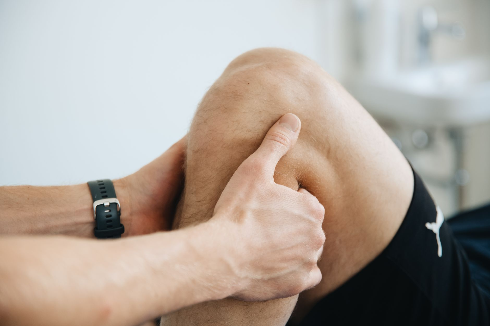

A lesão do ligamento cruzado anterior (LCA) é uma das mais temidas por quem pratica esportes que envolvem mudanças bruscas de direção, como futebol, basquete e vôlei. Além do impacto imediato, ela costuma significar um longo período de afastamento — mas o que acontece nesse período faz toda a diferença entre um retorno seguro e uma nova lesão.

## Cirurgia ou tratamento conservador?

Nem toda lesão de LCA exige cirurgia. A decisão depende de fatores como o nível de instabilidade do joelho, a modalidade esportiva praticada e os objetivos do paciente. Atletas que pretendem voltar a esportes de alto impacto costumam se beneficiar da reconstrução cirúrgica, enquanto pessoas menos ativas podem responder bem a um programa fisioterapêutico bem conduzido, focado em fortalecimento e controle neuromuscular.

Em ambos os casos, a fisioterapia é parte central do tratamento — seja preparando o joelho para a cirurgia, seja conduzindo a reabilitação completa sem ela.

## As fases da reabilitação

Depois da cirurgia (ou no tratamento conservador), a reabilitação segue etapas que não devem ser puladas:

1. **Controle de dor e inchaço** — nas primeiras semanas, o foco é proteger o enxerto ou o tecido lesionado e recuperar a extensão completa do joelho.
2. **Recuperação de amplitude e força inicial** — reintrodução gradual de exercícios de fortalecimento, começando por cadeia cinética fechada.
3. **Fortalecimento avançado e propriocepção** — trabalho de equilíbrio, estabilidade e força específica para as exigências do esporte.
4. **Treino funcional e pliometria** — saltos, mudanças de direção e gestos esportivos, sempre com progressão controlada.

## Por que o retorno precoce é arriscado

Um dos maiores riscos após lesão de LCA não é a lesão original, e sim a recidiva — seja no mesmo joelho, seja no oposto. Isso costuma acontecer quando o atleta retorna ao esporte antes de recuperar força, controle neuromuscular e confiança suficientes, geralmente pressionado pela vontade de competir novamente.

Por isso, o retorno ao esporte costuma se basear em critérios objetivos, como simetria de força entre os membros, desempenho em testes de salto e ausência de compensações durante gestos específicos da modalidade — e não apenas no tempo decorrido desde a cirurgia.

## O papel do acompanhamento contínuo

Reabilitar um LCA é um processo que geralmente leva de seis meses a um ano, dependendo dos objetivos esportivos. O acompanhamento fisioterapêutico ao longo de todo esse período ajuda a ajustar a progressão de acordo com a resposta individual de cada atleta, reduzindo o risco de novas lesões e construindo confiança para o retorno pleno à modalidade praticada.

---

_As informações deste artigo têm finalidade educativa. O tempo e as etapas de reabilitação variam de pessoa para pessoa e devem ser definidos junto a um fisioterapeuta após avaliação individual._
