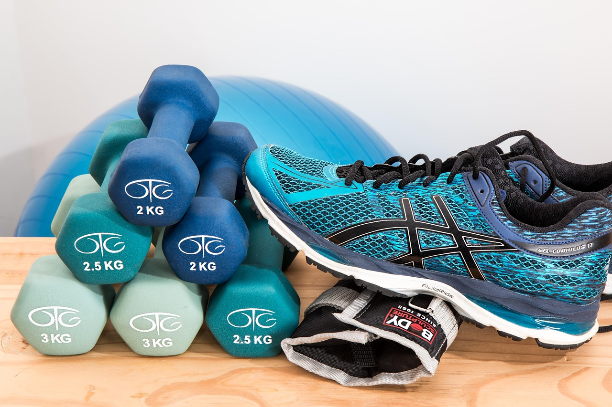

O rolo de espuma, ou foam roller, deixou de ser um equipamento só de academia e hoje aparece em salas de estar, vestiários e consultórios de fisioterapia. A promessa costuma ser simples: rolar o músculo por alguns minutos e sentir alívio na tensão e mais liberdade de movimento. Mas nem todo mundo usa o rolo do jeito que realmente ajuda, e alguns exageram na pressão achando que "quanto mais dói, melhor funciona" — o que é um equívoco.

## O que realmente acontece durante a liberação miofascial

O termo "liberação miofascial" sugere que a pressão do rolo desfaz nós ou "libera" a fáscia — o tecido conjuntivo que envolve os músculos. Na prática, o efeito é mais sutil: a pressão sustentada estimula receptores nervosos que reduzem temporariamente a tensão do músculo, além de melhorar a percepção da região e o fluxo sanguíneo local. Não é que o tecido esteja "colado" e o rolo o desprenda — é o sistema nervoso respondendo ao estímulo e permitindo mais amplitude de movimento por um período.

Essa diferença importa na prática: o benefício tende a ser temporário e funciona melhor como preparação para o movimento ou como recuperação, não como solução isolada para uma dor que já é crônica ou estrutural.

## Como usar o rolo sem se machucar

Alguns cuidados fazem toda a diferença entre uma sessão que ajuda e uma que deixa o músculo mais irritado:

- **Pressão progressiva**, começando leve e aumentando apenas se o corpo tolerar bem, sem buscar o limite da dor.
- **Movimento lento**, rolando a região por cerca de 30 a 60 segundos, sem pressa para "cobrir tudo" de uma vez.
- **Evitar articulações e ossos salientes**, direcionando a pressão para o ventre muscular, e não para joelho, coluna ou quadril.
- **Nunca rolar direto sobre uma lesão aguda**, como um estiramento recente, uma área inchada ou muito dolorida ao toque.
- **Respirar normalmente**, sem travar a respiração para "aguentar" a pressão — isso costuma indicar que ela está além do que o corpo tolera bem.

## Quando incluir na rotina

O rolo de espuma funciona bem em dois momentos específicos. Antes do treino ou de uma atividade física, ele ajuda a "despertar" a musculatura e ganhar amplitude antes do aquecimento dinâmico. Depois do treino, contribui para reduzir a sensação de tensão e apoiar a recuperação, especialmente em regiões que costumam ficar mais sobrecarregadas, como panturrilha, quadríceps e região lateral da coxa.

Fora desses contextos, também pode ser usado em pausas do dia a dia, sobretudo por quem passa longos períodos sentado e sente a musculatura das pernas ou das costas mais tensa. O importante é não depender só dele: a liberação miofascial complementa uma rotina de mobilidade e fortalecimento, não substitui os exercícios ativos.

## Sinais de que vale buscar avaliação

Se uma região específica está sempre tensa, mesmo com uso regular do rolo, ou se aparece dor que incomoda fora da sessão de liberação, isso pode indicar algo além de tensão muscular comum — como um desequilíbrio de movimento, uma sobrecarga repetitiva ou uma lesão em formação. Nesses casos, o rolo de espuma sozinho não resolve a causa, e uma avaliação com fisioterapeuta ajuda a entender o que está gerando aquela tensão persistente e a construir uma conduta mais completa.

---

*Este conteúdo tem propósito educativo e não substitui uma avaliação individual com um profissional de fisioterapia, que pode indicar a técnica e a intensidade mais adequadas para cada pessoa.*
