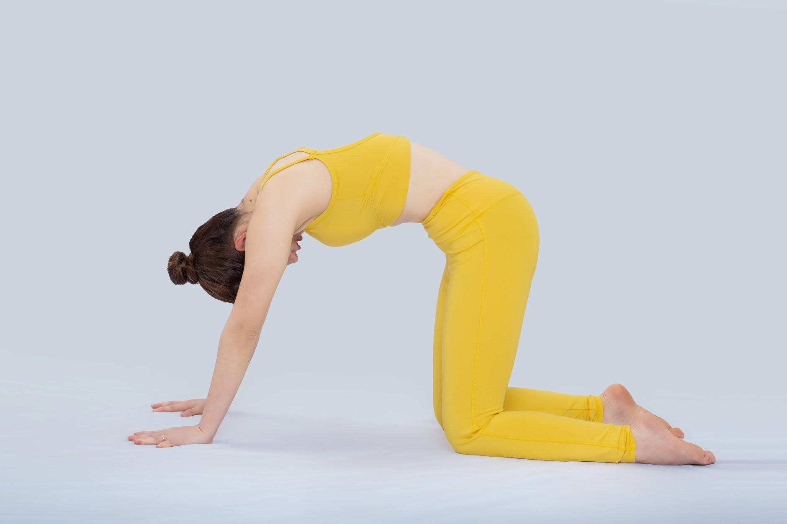

Quando o assunto é dor nas costas, a atenção costuma ir direto pra lombar. Mas boa parte dos quadros de dor no ombro e na região lombar tem uma origem menos óbvia: a rigidez na coluna torácica, a parte do meio das costas que passa despercebida até parar de se mover direito.

## Por que a coluna torácica trava

A coluna torácica é presa às costelas, o que já limita naturalmente sua mobilidade em comparação com o pescoço e a lombar. Some a isso horas sentado com a postura curvada para frente — no computador, no celular, dirigindo — e o resultado é uma região que perde ainda mais amplitude de movimento com o tempo, especialmente na rotação e na extensão (o movimento de "abrir" o peito para trás).

## O efeito cascata em outras articulações

O corpo é uma cadeia: quando uma articulação perde mobilidade, as vizinhas costumam compensar. Se a coluna torácica não gira ou não estende o suficiente, o ombro tende a assumir parte desse movimento, aumentando a sobrecarga na articulação e favorecendo quadros como impacto e tendinites. Da mesma forma, a lombar pode compensar a falta de extensão torácica, ficando mais exposta a dor por sobrecarga mecânica.

## Sinais de que vale prestar atenção

- Dificuldade de girar o tronco sem também girar o quadril.
- Sensação de "trava" entre as escápulas ao tentar juntar as costas.
- Postura arredondada mesmo em momentos de esforço consciente para "ficar ereto".
- Dor no ombro ou na lombar que não melhora só tratando a região dolorida.

## Como a fisioterapia trabalha essa região

O tratamento costuma combinar mobilização manual da coluna torácica, exercícios de rotação e extensão guiados — muitas vezes usando um rolo ou apoio sob as costas para facilitar o movimento — e fortalecimento da musculatura que sustenta a postura entre as escápulas. Pequenas rotinas diárias, de poucos minutos, já costumam trazer ganho perceptível de amplitude em algumas semanas quando feitas com regularidade.

## Vale lembrar

Rigidez torácica raramente aparece isolada — geralmente é parte de um quadro maior de dor no ombro, no pescoço ou na lombar. Uma avaliação fisioterapêutica ajuda a identificar se essa região está, de fato, contribuindo para o sintoma que trouxe a pessoa ao consultório, e a montar exercícios específicos para o caso.

---

_Este texto tem fins educativos. A avaliação individual com um fisioterapeuta é o caminho mais seguro para identificar a causa real de uma dor persistente._
