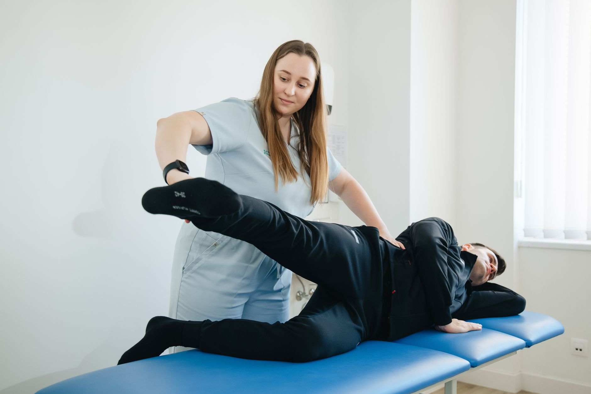

Punho e mão fazem parte de um dos grupos de articulações mais usados do corpo, e também um dos mais negligenciados nas rotinas de cuidado. A atenção com mobilidade costuma ir para ombro, quadril ou coluna, enquanto as mãos seguem repetindo o mesmo padrão de movimento — digitar, segurar o celular, usar o mouse — hora após hora, sem nenhuma variação. Com o tempo, essa repetição sem pausa pode deixar a região rígida, dolorida e menos eficiente para tarefas simples do cotidiano.

## Por que essa região trava com tanta facilidade

O punho é formado por vários ossos pequenos que trabalham juntos para permitir uma amplitude de movimento grande em todas as direções. Só que boa parte das atividades modernas usa apenas uma fração dessa amplitude, sempre na mesma postura: pulso levemente estendido, dedos semifechados, movimento repetitivo e de curso curto. Os tecidos ao redor — tendões, ligamentos e a fáscia que envolve os músculos do antebraço — se adaptam a esse padrão limitado, e a mobilidade nas direções pouco usadas vai diminuindo aos poucos, sem que a pessoa perceba.

O resultado costuma aparecer como rigidez ao acordar, dificuldade em abrir bem a mão, sensação de "mão cansada" no fim do dia ou até dor que se estende do punho até o cotovelo.

## O que a falta de mobilidade pode desencadear

Quando o punho perde amplitude, o corpo compensa de outras formas — geralmente sobrecarregando estruturas que não foram feitas para isso. Alguns efeitos comuns incluem:

- Sobrecarga nos tendões que passam pelo túnel do carpo, favorecendo quadros de dor e formigamento.
- Compensação no cotovelo e no ombro, já que o antebraço tende a assumir posições menos favoráveis para compensar a rigidez do punho.
- Perda de força de preensão, tornando tarefas como abrir potes ou carregar sacolas mais desgastantes do que deveriam ser.
- Maior propensão a lesões por esforço repetitivo em pessoas que usam bastante as mãos no trabalho ou no esporte.

## Exercícios simples para recuperar amplitude

Pequenas pausas ativas ao longo do dia já fazem diferença. Alguns exercícios que costumam ser indicados:

- **Círculos de punho**, girando a mão lentamente para os dois lados, explorando toda a amplitude disponível.
- **Flexão e extensão assistida**, usando a outra mão para levar o punho suavemente para cima e para baixo, sustentando alguns segundos em cada posição.
- **Abertura e fechamento ativo dos dedos**, espalhando bem os dedos e depois fechando a mão por completo, para trabalhar tanto flexores quanto extensores.
- **Alongamento de antebraço com o braço estendido**, puxando os dedos suavemente para trás com a outra mão, mantendo o cotovelo esticado.

O ideal é fazer essas pausas a cada hora ou duas de trabalho contínuo com as mãos, sem esperar que o desconforto apareça para só então se movimentar.

## Quando vale procurar avaliação

Formigamento persistente, dor que não melhora com repouso, perda de força perceptível ou dificuldade para realizar movimentos simples do dia a dia são sinais de que a situação já passou do ponto de resolver apenas com alongamentos por conta própria. Nesses casos, uma avaliação fisioterapêutica ajuda a identificar se existe alguma estrutura mais comprometida e a montar uma conduta específica para recuperar a função da mão sem depender de compensações.

---

*As informações deste artigo são gerais e educativas; elas não substituem uma avaliação individual com um profissional, que consegue identificar a causa exata da rigidez ou da dor no seu caso.*
