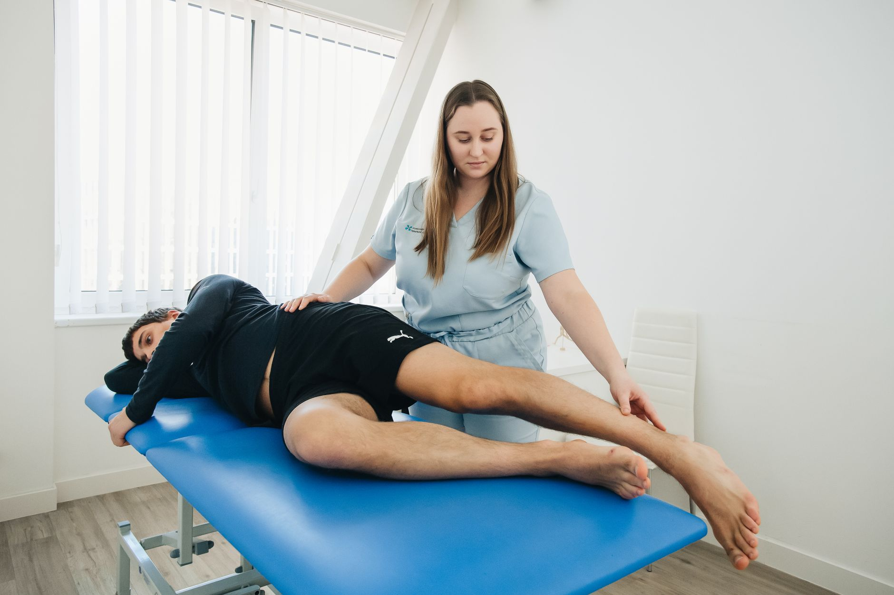

Passar muitas horas sentado — no trabalho, no trajeto ou em frente a telas — encurta a musculatura flexora do quadril e reduz a amplitude de movimento dessa articulação. Com o tempo, isso não fica restrito ao quadril: a lombar e o joelho costumam "pagar a conta" dessa rigidez, compensando movimentos que deveriam acontecer ali.

## Por que o quadril trava com o tempo sentado

Na posição sentada, o músculo iliopsoas (um dos principais flexores do quadril) permanece encurtado por horas seguidas. Ao longo do dia, o corpo se adapta a essa posição, e a extensão completa do quadril — necessária para caminhar, correr ou agachar com boa mecânica — fica cada vez mais limitada.

Essa limitação costuma se manifestar como:

- Sensação de rigidez ao levantar da cadeira.
- Dor lombar que piora ao final do dia.
- Desconforto no joelho durante atividades como subir escadas ou agachar.

## Três exercícios para destravar o quadril

**Alongamento do flexor de quadril em avanço** — em posição de afundo, com um joelho no chão, empurre o quadril suavemente para frente até sentir o alongamento na parte da frente da coxa da perna de trás. Mantenha por 20 a 30 segundos de cada lado.

**Rotação de quadril em quadrupedia** — apoiado em quatro apoios, faça círculos controlados com um dos joelhos, explorando toda a amplitude da articulação sem forçar. Repita 8 a 10 vezes de cada lado.

**Ponte de glúteo** — deitado de costas, com os joelhos dobrados, eleve o quadril contraindo os glúteos, mantenha por 2 segundos no topo e desça controladamente. Além de trabalhar mobilidade, fortalece a musculatura que estabiliza o quadril.

## Pausas ativas fazem diferença

Além dos exercícios dedicados, pequenas pausas ao longo do dia — levantar a cada hora, caminhar por alguns minutos ou simplesmente mudar de posição — ajudam a evitar que a rigidez se acumule. Não é preciso uma rotina longa: consistência importa mais do que duração.

## Quando procurar ajuda profissional

Se a rigidez de quadril vem acompanhada de dor persistente, sensação de travamento ou limitação progressiva de movimento, vale buscar uma avaliação fisioterapêutica. Em alguns casos, o que parece só "falta de alongamento" pode estar relacionado a um desequilíbrio muscular mais específico, que se beneficia de um plano de exercícios individualizado.

---

_Este texto tem finalidade educativa. Antes de iniciar uma rotina de exercícios, especialmente se você já sente dor, procure orientação de um profissional de fisioterapia._
