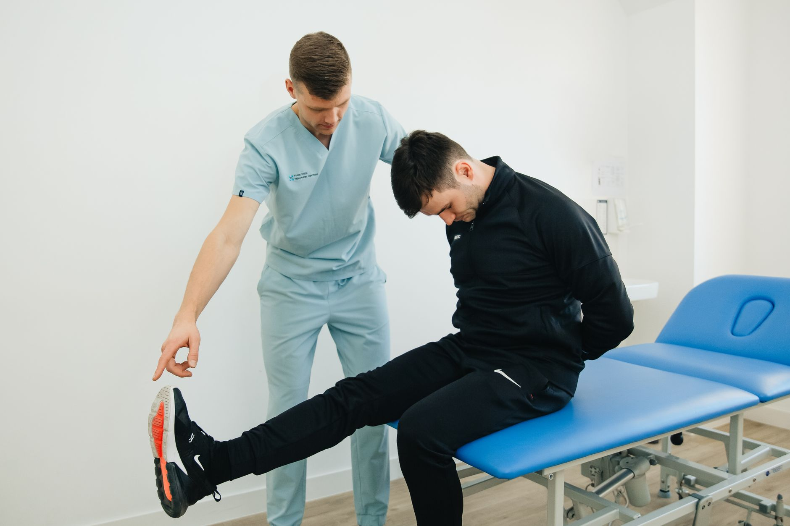

O tornozelo costuma ser esquecido nas rotinas de mobilidade — a atenção geralmente vai para quadril, ombro ou coluna. Mas essa articulação é a base de praticamente todo movimento em pé, e sua rigidez tem um efeito em cadeia: quando o tornozelo não se move o suficiente, outras articulações precisam compensar, muitas vezes de forma inadequada.

## O efeito em cadeia da rigidez

Um dos movimentos mais importantes do tornozelo é a dorsiflexão — a capacidade de levar o pé em direção à canela, essencial para agachar, descer escadas ou simplesmente caminhar com uma passada eficiente. Quando essa amplitude está limitada, o corpo encontra formas alternativas de completar o movimento:

- O joelho pode rotacionar internamente para compensar, sobrecarregando estruturas como o menisco e os ligamentos.
- O quadril pode assumir parte do movimento que deveria vir do tornozelo, alterando o padrão de agachamento.
- A lombar pode compensar com maior curvatura durante atividades como levantar peso do chão.

Ou seja, uma dor no joelho ou na lombar às vezes tem origem em uma articulação bem mais distante — o tornozelo.

## Exercícios para melhorar a mobilidade

**Dorsiflexão na parede (knee-to-wall)** — em pé, de frente para uma parede, posicione o pé a uma distância curta e tente tocar o joelho na parede sem levantar o calcanhar do chão. Repita 10 vezes de cada lado, avançando a distância conforme a mobilidade melhora.

**Círculos de tornozelo** — sentado ou em pé com apoio, faça círculos amplos e controlados com o pé, em ambas as direções, 10 repetições de cada lado.

**Agachamento com apoio** — segurando em um suporte para equilíbrio, desça em um agachamento completo, permitindo que o tornozelo trabalhe sua amplitude máxima de forma controlada.

## Atenção a entorses anteriores

Pessoas que já tiveram entorses de tornozelo tendem a desenvolver mais rigidez nessa articulação com o tempo, mesmo depois de a lesão estar "curada". Isso reforça a importância de manter um trabalho contínuo de mobilidade, e não apenas durante a fase aguda da reabilitação.

## Vale a avaliação profissional

Se a rigidez de tornozelo vem acompanhada de dor, instabilidade ao caminhar em superfícies irregulares ou histórico de entorses recorrentes, uma avaliação fisioterapêutica ajuda a identificar se há um componente estrutural ou muscular específico por trás da limitação.

## O calçado também influencia a mobilidade

Calçados com salto elevado, mesmo que discreto, mantêm o tornozelo em uma posição de flexão plantar prolongada, o que ao longo do tempo pode encurtar a musculatura da panturrilha e reduzir a amplitude de dorsiflexão disponível. Alternar o uso desse tipo de calçado com opções mais baixas e planas, sempre que possível, ajuda a preservar a mobilidade natural da articulação. Para quem pratica atividades físicas, o tipo de tênis também importa: calçados com muito amortecimento no calcanhar podem, em alguns casos, mascarar a percepção do movimento do tornozelo durante o apoio, o que reforça a importância de variar os estímulos ao longo da semana.

## Perguntas frequentes

**Quanto tempo leva para recuperar a mobilidade perdida do tornozelo?** Com prática regular, muitas pessoas notam melhora perceptível dentro de 3 a 6 semanas, embora o tempo varie conforme o grau de rigidez inicial e a frequência dos exercícios.

**Esses exercícios substituem a reabilitação depois de uma entorse recente?** Não. Em entorses recentes, o processo de reabilitação segue etapas específicas de controle de dor, força e propriocepção, conduzidas por um fisioterapeuta, e esses exercícios de mobilidade geral entram em um momento mais avançado desse processo.

## Tornozelo e agachamento: uma relação direta

A profundidade e a qualidade de um agachamento dependem, em boa parte, da dorsiflexão disponível no tornozelo. Quando essa amplitude está limitada, o corpo compensa de formas que alteram todo o padrão do movimento: o tronco se inclina mais para frente, os calcanhares tendem a levantar do chão, ou os joelhos rotacionam para dentro na tentativa de completar a descida. Esse é um dos motivos pelos quais melhorar a mobilidade do tornozelo costuma ser um dos primeiros ajustes recomendados para quem sente dificuldade ou desconforto ao agachar, seja na academia, seja em tarefas simples como abaixar para pegar algo no chão.

**Alongar a panturrilha é a mesma coisa que trabalhar a mobilidade do tornozelo?** São complementares, mas não idênticos. O alongamento foca em ganhar comprimento muscular, enquanto os exercícios de mobilidade trabalham o movimento ativo e controlado da articulação — o ideal é combinar os dois para um resultado mais completo.

**Esses exercícios servem para praticantes de dança ou artes marciais?** Sim, modalidades que exigem grande amplitude de tornozelo se beneficiam ainda mais desse trabalho, já que a demanda funcional é maior do que em atividades do dia a dia, e a falta de amplitude tende a limitar diretamente o desempenho nesses movimentos.

---

_Este conteúdo é educativo e não substitui uma avaliação individual. Quadros de dor ou instabilidade no tornozelo devem ser investigados por um profissional._
