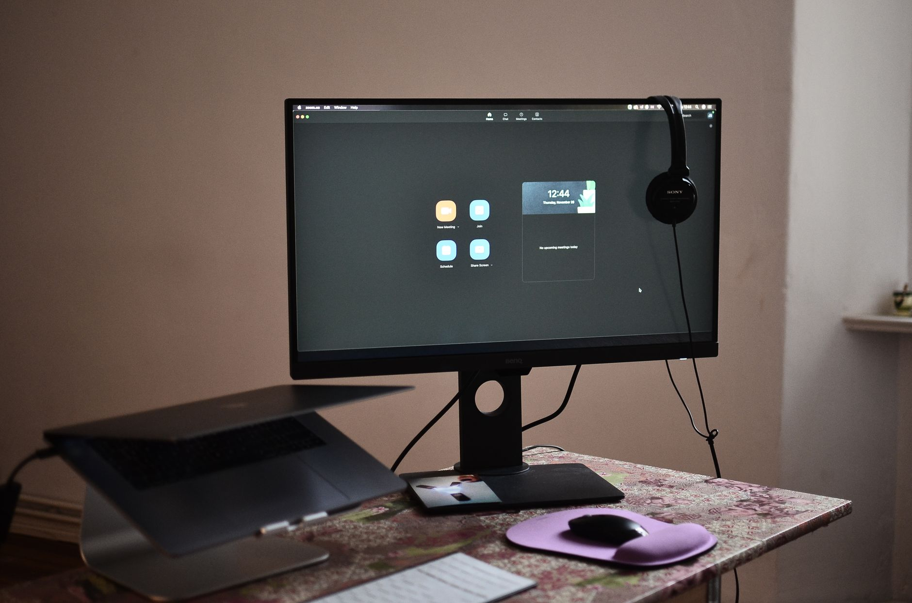

Depois que o trabalho remoto se tornou parte da rotina de tanta gente, um tipo de queixa passou a aparecer com muito mais frequência no consultório: dor nas costas relacionada ao ambiente de trabalho em casa. A boa notícia é que, na maioria dos casos, alguns ajustes simples fazem bastante diferença.

## Por que o home office costuma piorar a postura

Em um escritório tradicional, cadeira, mesa e monitor geralmente seguem algum padrão ergonômico mínimo. Em casa, é comum trabalhar no sofá, na cama ou em uma mesa de jantar não pensada para longas horas de uso — o que obriga a coluna a assumir posições que ela não sustenta bem por muito tempo.

O problema não é ficar sentado por si só, mas a combinação de má postura mantida com pouquíssima variação de posição ao longo do dia.

## Ajustes que fazem diferença real

Não é preciso montar um escritório profissional para melhorar bastante a postura. Alguns pontos prioritários:

- **Altura da tela**: a parte superior do monitor (ou do notebook, com um suporte) deve ficar na altura dos olhos, evitando inclinar o pescoço para baixo.
- **Apoio para os braços**: cotovelos apoiados, próximos a um ângulo de 90 graus, tiram carga da região do pescoço e dos ombros.
- **Apoio lombar**: uma almofada ou toalha enrolada na altura da lombar já ajuda a manter a curvatura natural da coluna em uma cadeira sem apoio adequado.
- **Pés apoiados no chão**, sem que a parte de trás dos joelhos fique pressionada contra o assento.

## O hábito que importa mais que a cadeira ideal

Mesmo com a postura perfeita, ficar parado na mesma posição por horas sobrecarrega qualquer estrutura do corpo. Pausas curtas e frequentes — levantar, alongar, caminhar alguns passos a cada 40 ou 50 minutos — costumam ter mais impacto na prevenção da dor do que o modelo exato da cadeira.

## Quando os ajustes não são suficientes

Se a dor persiste mesmo depois de mudanças no ambiente e na rotina, ou se vem acompanhada de formigamento, perda de força ou irradiação para os braços, vale buscar uma avaliação fisioterapêutica. Muitas vezes, por trás da dor relacionada à postura, existe também uma perda de mobilidade ou de força que precisa ser trabalhada de forma específica — algo que a orientação individualizada de um fisioterapeuta identifica com mais precisão do que qualquer ajuste genérico de ergonomia.

---

_Este conteúdo tem caráter educativo. Ajustes ergonômicos ajudam bastante, mas não substituem uma avaliação profissional quando a dor já está instalada._
