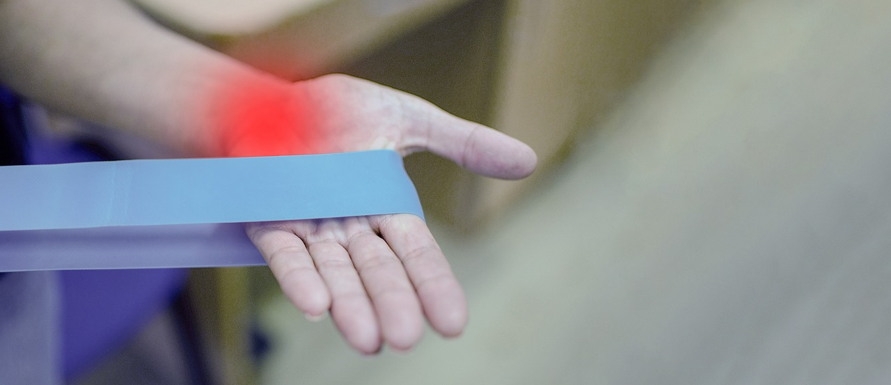

Depois de um infarto ou de uma cirurgia cardíaca, é natural surgir um misto de alívio por ter superado o momento agudo e medo de voltar a se movimentar. Muita gente passa a evitar esforços que antes eram rotina, com receio de que qualquer aceleração do coração signifique perigo. A reabilitação cardíaca existe justamente para essa fase: um programa estruturado, conduzido com apoio da fisioterapia, que devolve a capacidade física de forma progressiva e monitorada, mostrando na prática que o coração pode — e deve — voltar a ser exigido dentro de limites seguros.

## O que é a reabilitação cardíaca

Trata-se de um programa que combina exercício físico supervisionado, controle de fatores de risco e orientação sobre a própria condição cardíaca, sempre em conjunto com a equipe médica responsável pelo caso. Dentro desse programa, a fisioterapia cuida especificamente da prescrição e progressão dos exercícios, ajustando intensidade, tipo de atividade e ritmo de evolução de acordo com o que os exames cardiológicos indicam ser seguro para cada pessoa. Não é um treino genérico: cada etapa é pensada para desafiar o coração o suficiente para que ele se fortaleça, sem ultrapassar o que o músculo cardíaco consegue tolerar naquele momento da recuperação.

## As fases do tratamento

O processo costuma ser dividido em etapas. Ainda no hospital, logo após o evento ou a cirurgia, o trabalho é de mobilização precoce — sentar, ficar em pé, dar os primeiros passos — para evitar os efeitos do repouso prolongado no leito sem sobrecarregar o coração. Depois da alta, entra a fase ambulatorial, geralmente a mais estruturada, com sessões supervisionadas de exercício aeróbico e fortalecimento, sinais vitais monitorados a cada sessão e progressão de carga combinada com a resposta do organismo. Por fim, há uma fase de manutenção, em que a pessoa já assimilou os limites seguros e ganha mais autonomia para manter a atividade física no longo prazo.

## Como os exercícios são dosados com segurança

Um dos pontos que mais tranquiliza quem inicia a reabilitação cardíaca é perceber o quanto cada exercício é calculado. A frequência cardíaca e a pressão arterial são acompanhadas antes, durante e depois da atividade, e escalas de percepção de esforço ajudam a dosar a intensidade sem depender só de números. Os parâmetros de segurança costumam ser definidos a partir de um teste ergométrico ou de outra avaliação cardiológica prévia, que mostra até onde o coração responde bem ao esforço. Com essas referências, a progressão acontece em pequenos incrementos, revisados constantemente conforme a evolução de cada paciente.

## Benefícios que vão além do coração

Os ganhos da reabilitação cardíaca não se limitam à musculatura cardíaca. A capacidade de realizar tarefas do dia a dia sem cansaço excessivo melhora de forma consistente, assim como a força muscular geral, perdida durante o período de menor atividade. Há também um efeito emocional importante: acompanhar de perto a própria evolução, sob supervisão profissional, reduz o medo de se exercitar e devolve confiança para retomar caminhadas, tarefas domésticas, trabalho e lazer. Com o tempo, a maioria das pessoas percebe que consegue fazer mais do que imaginava logo após o evento cardíaco, o que reforça a adesão ao programa e aos novos hábitos que ele ajuda a construir.

## Perguntas frequentes

**Quanto tempo depois do infarto posso começar a reabilitação cardíaca?** Varia conforme a gravidade do evento e a liberação médica, mas a mobilização inicial costuma começar ainda durante a internação, e a fase ambulatorial geralmente é iniciada poucas semanas após a alta.

**É seguro fazer exercício depois de um infarto?** Sim, quando conduzido dentro de um programa supervisionado, com os parâmetros de segurança adequados a cada pessoa. Na verdade, o sedentarismo após o evento cardíaco costuma representar um risco maior do que o exercício bem dosado.

**A reabilitação cardíaca substitui a medicação?** Não. Ela complementa o tratamento médico, incluindo o uso de medicações prescritas, e ajuda a reduzir fatores de risco associados, mas não substitui nenhuma orientação médica em curso.

**Posso voltar a fazer todas as atividades de antes?** Na maioria dos casos, sim, dentro de um ritmo de retomada gradual. O objetivo da reabilitação cardíaca é justamente devolver a maior parte da capacidade funcional anterior, com segurança e acompanhamento adequado ao longo do processo.

**Quanto tempo dura o programa de reabilitação cardíaca?** A fase ambulatorial mais estruturada costuma durar entre 8 e 12 semanas, embora a manutenção da atividade física, depois disso, seja recomendada por toda a vida como parte dos novos hábitos construídos durante o programa de reabilitação.

**Família pode participar do acompanhamento?** Sim, e costuma ser bem-vindo. O apoio familiar ajuda na adesão ao programa e na manutenção dos novos hábitos de vida após a alta do tratamento supervisionado.

---

*Este conteúdo tem finalidade educativa. A prescrição de exercícios após um evento cardíaco deve sempre partir de avaliação médica e fisioterapêutica individual, que vai considerar exames, histórico e condição clínica de cada pessoa.*
