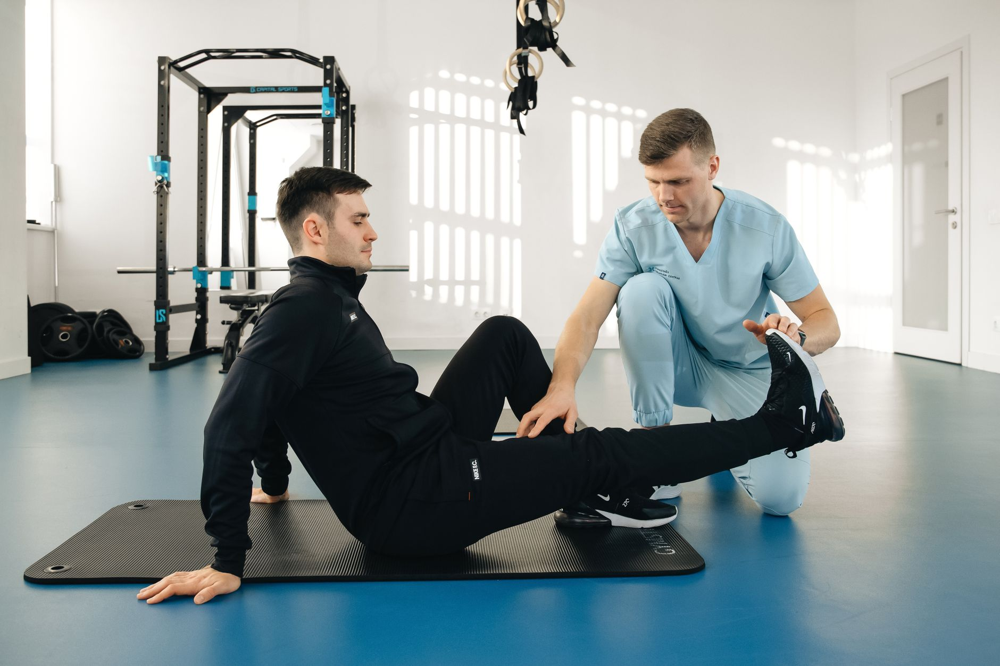

Uma fratura de fêmur é uma das lesões ortopédicas mais impactantes na rotina de quem a sofre, especialmente em pessoas mais velhas. Além da recuperação óssea em si, o corpo perde força e confiança para caminhar, o que torna a reabilitação um processo tão importante quanto o próprio tratamento cirúrgico ou ortopédico inicial.

## A fase inicial: proteger o osso em consolidação

Logo após a fratura — tratada de forma cirúrgica, na maioria dos casos — o osso ainda está em processo de consolidação, e o fisioterapeuta trabalha dentro dos limites de carga liberados pela equipe ortopédica. Nessa etapa, o cuidado costuma incluir:

- Mobilização precoce das articulações vizinhas, como quadril e joelho, para evitar rigidez.
- Exercícios de ativação muscular que não sobrecarreguem o local da fratura.
- Orientação sobre uso correto de dispositivos de apoio, como andador ou muletas.

## Recuperando a confiança para caminhar

Um dos aspectos menos falados da reabilitação após fratura de fêmur é o componente emocional: o medo de cair de novo é real e influencia diretamente a forma como a pessoa se move. Por isso, o treino de marcha não é apenas sobre força muscular — envolve também recuperar a confiança para transferir peso para a perna afetada.

O fisioterapeuta costuma progredir esse treino em etapas, começando com apoio parcial de peso, avançando para a marcha assistida por dispositivos e, quando indicado, chegando à marcha independente.

## Fortalecimento e equilíbrio: a base da prevenção

Depois que o osso consolida e a marcha básica está reestabelecida, o programa de reabilitação passa a priorizar força muscular — principalmente de quadril e coxa — e exercícios de equilíbrio. Essa combinação é essencial porque grande parte das fraturas de fêmur acontece após uma queda, e reduzir o risco de uma nova queda é um dos objetivos centrais do tratamento.

## Um processo que exige tempo

A recuperação completa após uma fratura de fêmur costuma ser mais longa do que a de outras lesões ortopédicas, podendo levar vários meses até a retomada plena das atividades anteriores. Isso é especialmente verdadeiro em pacientes idosos, onde o objetivo muitas vezes vai além de "andar de novo" — é recuperar a autonomia para as atividades do dia a dia com segurança.

## Prevenção de uma nova fratura

Como grande parte das fraturas de fêmur em pessoas mais velhas está associada a quedas, a reabilitação não termina quando a marcha é reestabelecida — ela se estende para um trabalho contínuo de prevenção. Isso envolve fortalecimento muscular de manutenção, treino regular de equilíbrio e, muitas vezes, orientações sobre adaptações no ambiente doméstico, como remover tapetes soltos e melhorar a iluminação de corredores e escadas. Sem essa continuidade, o risco de uma nova queda — e, consequentemente, de uma nova fratura — permanece elevado mesmo depois que a pessoa já está caminhando novamente sem apoio.

## O impacto da idade na velocidade de recuperação

A idade influencia diretamente o ritmo da reabilitação após uma fratura de fêmur, mas não determina sozinha o resultado final. Pacientes mais jovens costumam progredir mais rápido pelas etapas de consolidação óssea e fortalecimento, enquanto pacientes idosos frequentemente precisam de uma progressão mais cautelosa, especialmente quando já existiam outras limitações de saúde antes da fratura. Ainda assim, mesmo em idade avançada, a maioria dos pacientes que se engaja de forma consistente no programa de reabilitação recupera um nível relevante de independência funcional, o que reforça que a idade sozinha não deveria ser motivo para reduzir as expectativas sobre o tratamento.

## Perguntas frequentes

**Quanto tempo leva para voltar a caminhar sem apoio?** Varia bastante conforme a gravidade da fratura, o tipo de fixação cirúrgica e a condição física prévia, mas muitos pacientes retomam a marcha com algum tipo de apoio dentro de algumas semanas, evoluindo depois para a marcha independente.

**É normal sentir medo de cair durante a reabilitação?** Sim, é uma reação comum e esperada. Parte do trabalho fisioterapêutico é justamente ajudar a reconstruir a confiança de forma gradual, através de exercícios seguros e progressivos.

**Quais exercícios costumam ser mais indicados nessa fase de fortalecimento?** Exercícios de fortalecimento de quadril e coxa, treino de equilíbrio em superfícies estáveis e instáveis, e treino funcional de subir e descer degraus costumam compor essa fase, sempre progredindo conforme a resposta individual do paciente.

**Uma pessoa que já teve fratura de fêmur pode voltar a fazer atividades físicas regulares?** Sim, na maioria dos casos, especialmente com uma reabilitação bem conduzida. Atividades de baixo impacto, como caminhada, hidroginástica e fortalecimento orientado, costumam ser bem toleradas e recomendadas como parte da manutenção a longo prazo, sempre respeitando a evolução individual de cada pessoa e o histórico de saúde prévio ao evento da fratura, sempre com acompanhamento profissional regular.

---

_Este artigo tem caráter educativo. O ritmo de progressão da carga e dos exercícios após uma fratura deve seguir sempre a liberação da equipe médica e a avaliação do fisioterapeuta responsável._
