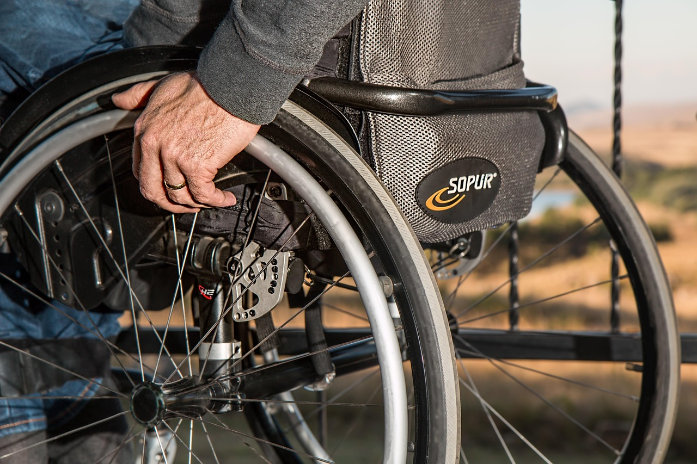

Um acidente vascular cerebral (AVC) pode afetar movimento, equilíbrio, coordenação e sensibilidade de formas muito diferentes de pessoa para pessoa, dependendo da área do cérebro atingida. A fisioterapia neurofuncional entra logo nas primeiras fases da recuperação, com um objetivo central: ajudar o sistema nervoso a reorganizar suas conexões e recuperar o máximo de função possível.

## Por que começar cedo faz diferença

O cérebro tem uma capacidade chamada neuroplasticidade — a habilidade de reorganizar conexões neurais e, em certa medida, "reaprender" movimentos e funções. Estimular essa reorganização de forma precoce, ainda durante a internação ou logo após a alta hospitalar, costuma favorecer melhores resultados funcionais ao longo do tempo.

Nas primeiras fases, o trabalho costuma envolver:

- Prevenção de complicações ligadas à imobilidade, como rigidez articular e perda de força.
- Estímulo a movimentos ativos do lado afetado, mesmo que inicialmente pequenos ou parciais.
- Treino de posicionamento e transferências (deitar, sentar, levantar) com segurança.

## Recuperando controle de movimento

Diferente de uma lesão ortopédica, a dificuldade após um AVC não costuma estar no músculo em si, mas no comando que o cérebro envia para ele. Por isso, os exercícios de fisioterapia neurológica têm um foco grande em repetição e estímulo sensório-motor, ajudando o sistema nervoso a recuperar controle sobre o movimento, e não apenas força.

## Equilíbrio, marcha e autonomia

Conforme a recuperação avança, o treino de equilíbrio e marcha ganha espaço central no tratamento. Muitas pessoas retomam a capacidade de caminhar de forma independente, ainda que com adaptações, enquanto outras podem continuar precisando de apoio, dependendo da extensão do AVC. Em qualquer um desses cenários, o objetivo da fisioterapia é sempre o mesmo: ampliar ao máximo a autonomia da pessoa nas atividades do dia a dia.

## Um processo contínuo e individual

A recuperação após um AVC não segue um cronograma fixo — varia conforme a extensão da lesão neurológica, o tempo até o início da reabilitação e a resposta individual de cada paciente ao tratamento. Ganhos podem continuar acontecendo por meses, o que reforça a importância de manter o acompanhamento fisioterapêutico mesmo quando o progresso parece mais lento.

---

_Este conteúdo tem fins educativos e não substitui a avaliação de uma equipe multiprofissional. Cada caso de AVC é único e exige um plano de reabilitação individualizado._
