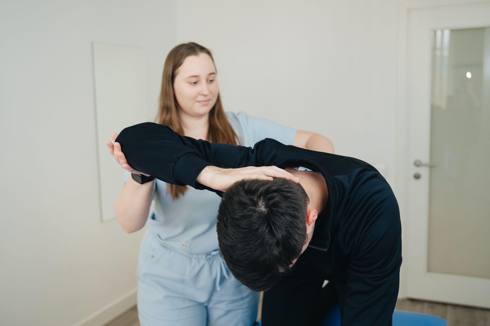

Sair de uma cirurgia ortopédica costuma trazer uma mistura de alívio e insegurança: alívio por resolver o problema que motivou a operação, insegurança por não saber exatamente o que esperar dali para frente. As primeiras semanas de reabilitação são decisivas para o resultado final, e entender o que acontece em cada fase ajuda o paciente a se sentir mais confiante no processo.

## Os primeiros dias: proteger sem imobilizar demais

Logo após a cirurgia, o foco não é "fazer exercício" — é proteger o tecido operado enquanto ele começa a cicatrizar. Isso não significa ficar parado. Na maioria dos casos, o fisioterapeuta orienta pequenos movimentos controlados desde cedo, porque a imobilização prolongada tende a gerar rigidez, perda de força e até mais dor do que o movimento bem dosado.

Nessa fase, os objetivos costumam ser:

- Controlar a dor e o inchaço, com recursos como crioterapia e posicionamento adequado do membro.
- Manter uma circulação saudável, prevenindo complicações como trombose.
- Preservar a amplitude de movimento das articulações vizinhas à cirurgia, que não podem "enrijecer" enquanto a área operada se recupera.

## Semana 2 a 4: reconquistando amplitude de movimento

Conforme a cicatrização avança e a equipe cirúrgica libera a progressão, o trabalho de fisioterapia passa a incluir mobilizações mais ativas da própria articulação operada. O objetivo é recuperar, de forma gradual, a amplitude de movimento perdida — sem forçar além do que o tecido em reparo suporta.

É comum que essa fase traga desconforto, mas dor intensa ou inchaço que piora após os exercícios são sinais de que algo precisa ser ajustado no ritmo da progressão. A comunicação constante entre paciente e fisioterapeuta é o que permite calibrar essa dosagem.

## Depois do primeiro mês: força e função

Com a mobilidade em recuperação, o programa passa a priorizar o fortalecimento muscular da região operada e das estruturas ao redor, que muitas vezes perderam força pela inatividade ou pela própria dor pré-cirúrgica. Aos poucos, exercícios funcionais — que reproduzem tarefas do dia a dia, como subir escadas ou carregar objetos — vão sendo incorporados.

O tempo total desse processo varia bastante conforme o tipo de cirurgia, a idade e a condição física prévia do paciente, por isso comparar o próprio ritmo de recuperação com o de outra pessoa raramente é uma boa ideia.

## O papel do acompanhamento contínuo

Talvez o ponto mais importante das primeiras semanas seja este: reabilitação não é uma lista fixa de exercícios, é um processo que se ajusta constantemente com base na resposta do paciente. Um bom acompanhamento fisioterapêutico identifica cedo quando algo não está evoluindo como esperado, evitando que pequenos contratempos se transformem em complicações maiores.

---

_As informações deste artigo têm fins educativos. O protocolo de reabilitação após uma cirurgia deve ser sempre definido em conjunto com o cirurgião e o fisioterapeuta responsáveis pelo caso._
