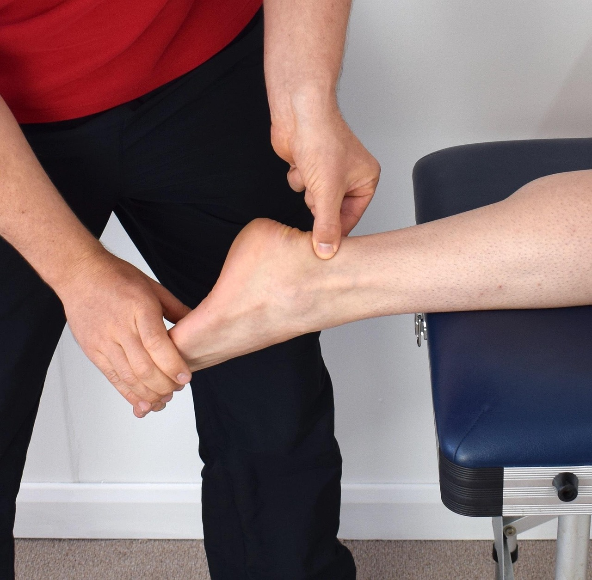

Passar dias ou semanas internado, seja por uma pneumonia grave, uma cirurgia de grande porte ou qualquer outra condição que exija repouso prolongado no leito, cobra um preço do corpo que vai muito além do motivo original da internação. É comum sair do hospital com falta de ar em esforços simples, cansaço para tarefas que antes eram automáticas e uma sensação de fraqueza generalizada. A reabilitação pulmonar existe justamente para reverter esse quadro, trabalhando ao mesmo tempo a respiração e a musculatura que o corpo perdeu durante o período parado.

## Por que o corpo perde tanto em pouco tempo

Dias de imobilidade no leito reduzem rapidamente a força muscular, inclusive a do diafragma e dos músculos que sustentam a respiração. Some a isso a própria doença que motivou a internação — muitas vezes com impacto direto nos pulmões — e o resultado é uma capacidade respiratória bem menor do que a pessoa tinha antes de ser internada. Esse efeito costuma surpreender: mesmo quem não teve nenhum problema pulmonar como causa principal da internação pode sentir falta de ar ao voltar a andar ou subir uma escada.

## O papel da fisioterapia respiratória

Nas primeiras etapas da reabilitação, o trabalho respiratório busca melhorar a ventilação pulmonar e ajudar na eliminação de secreções que se acumulam durante o período de menor mobilidade. Técnicas de expansão pulmonar, exercícios de respiração diafragmática e manobras específicas de higiene brônquica fazem parte dessa fase, sempre ajustadas à condição clínica de cada paciente e, quando ainda internado, em conjunto com a equipe médica.

## Recuperando força e resistência aos esforços

Respirar melhor é só parte do processo — o corpo também precisa recuperar a musculatura perdida durante a internação. Por isso, a reabilitação caminha lado a lado com exercícios motores: primeiro mobilizações simples e transferências (sentar, ficar em pé), depois caminhada progressiva e fortalecimento geral, sempre monitorando a resposta cardiorrespiratória a cada etapa. É comum usar escalas de percepção de esforço e monitorar a saturação de oxigênio durante os exercícios, para garantir que a progressão seja segura mesmo em quem ainda está fragilizado.

## Um progresso que exige paciência

A recuperação da capacidade pulmonar e física após uma internação longa raramente é linear. Pode haver dias de mais disposição seguidos por outros de mais cansaço, especialmente nas primeiras semanas após a alta. O acompanhamento fisioterapêutico contínuo ajuda a ajustar a intensidade dos exercícios a cada momento, evitando tanto o excesso de esforço quanto a estagnação por medo de se movimentar. Com constância, a maioria das pessoas recupera boa parte — e muitas vezes a totalidade — da disposição que tinham antes da internação, retomando gradualmente as atividades do dia a dia.

---

_As informações acima são de caráter geral e não substituem a avaliação de uma equipe de saúde, que definirá o plano de reabilitação mais adequado considerando a causa da internação e o estado clínico de cada pessoa._
