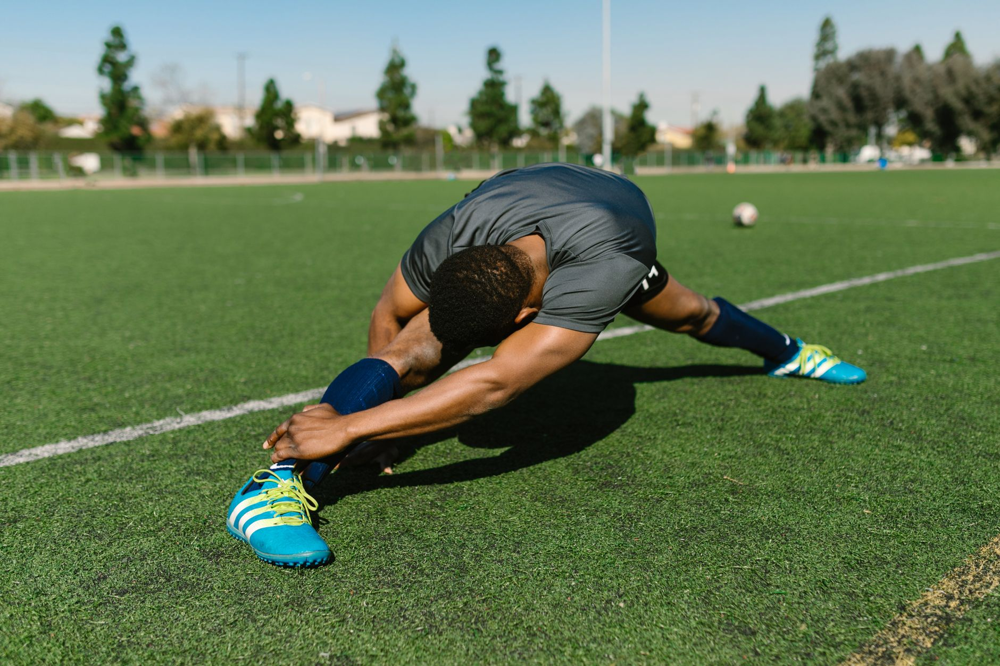

"Não tenho tempo para aquecer" é uma das justificativas mais comuns para pular essa etapa do treino — mas um bom aquecimento não precisa ser longo. Cinco minutos bem direcionados já são suficientes para preparar o corpo, reduzir o risco de lesão e melhorar o desempenho na atividade que vem em seguida.

## Por que aquecer importa

O aquecimento tem três funções principais: elevar gradualmente a temperatura muscular, aumentar a mobilidade das articulações que serão mais exigidas e "ligar" o sistema neuromuscular para o tipo de esforço que está por vir. Pular essa etapa não impede o treino de acontecer, mas aumenta a chance de o corpo responder de forma menos eficiente — e mais vulnerável — ao esforço.

## A rotina de 5 minutos

1. **1 minuto de elevação de frequência cardíaca** — marcha estacionária, polichinelos leves ou subida de joelho no lugar, em ritmo confortável.
2. **1 minuto de mobilidade de quadril** — círculos de quadril e passadas dinâmicas, alternando as pernas.
3. **1 minuto de mobilidade de ombro e tronco** — círculos de braço e rotações controladas de tronco.
4. **1 minuto de ativação de core** — prancha leve ou ponte de glúteo, para "acordar" a musculatura estabilizadora.
5. **1 minuto específico da atividade** — movimentos que reproduzem, em intensidade reduzida, o gesto principal do treino que vem a seguir (por exemplo, agachamentos leves antes de musculação, ou passadas progressivas antes de uma corrida).

## Adapte à atividade

Essa estrutura é um ponto de partida, não uma fórmula fixa. Um aquecimento antes de uma corrida vai priorizar mais mobilidade de quadril e tornozelo; antes de um treino de força superior, o foco pode se deslocar para ombro e tronco. O princípio é sempre o mesmo: preparar especificamente as articulações e grupos musculares que serão mais exigidos.

## O erro mais comum

O erro mais frequente não é pular o aquecimento por completo, mas fazê-lo de forma genérica demais — alongamentos estáticos isolados, sem relação com a atividade que vem a seguir. Um aquecimento eficiente é dinâmico, progressivo e direcionado, não apenas "esticar um pouco antes de começar".

---

_As orientações acima são gerais. Pessoas com lesões ativas ou limitações específicas devem ajustar o aquecimento com orientação de um fisioterapeuta._
