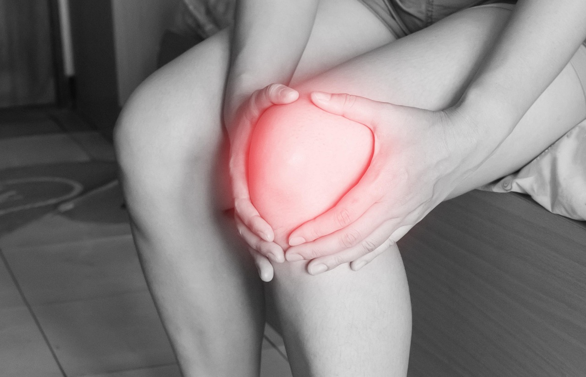

Quando se fala em cuidar da saúde óssea, a primeira lembrança costuma ser o cálcio na alimentação. Mas o osso é um tecido vivo que responde a estímulos mecânicos: ele se fortalece quando é exigido pelo movimento e perde densidade quando passa muito tempo sem carga. É por isso que o exercício físico, orientado da forma certa, é uma das ferramentas mais eficazes para prevenir a osteoporose — e a fisioterapia tem um papel direto nesse processo.

## Por que os ossos perdem densidade

Ao longo da vida, o corpo renova constantemente o tecido ósseo, substituindo osso antigo por osso novo. Até por volta dos 30 anos, esse processo tende a resultar em ganho ou manutenção de massa óssea. Depois disso, a tendência natural é de perda gradual, que se acelera em mulheres após a menopausa devido à queda dos níveis de estrogênio, hormônio que ajuda a proteger os ossos. Sedentarismo, histórico familiar e alguns medicamentos também contribuem para acelerar esse processo, que muitas vezes avança de forma silenciosa, sem sintomas, até resultar em uma fratura.

## O estímulo que o osso precisa

Os ossos respondem a dois tipos principais de estímulo: o impacto controlado e a tração exercida pelos músculos durante o esforço. Atividades como caminhada rápida, subir escadas e exercícios de fortalecimento com peso geram esse estímulo mecânico, sinalizando ao corpo que aquele osso precisa permanecer resistente. Já a inatividade prolongada — inclusive longos períodos sentado — envia o sinal contrário, favorecendo a perda de densidade óssea ao longo do tempo.

## Como um programa fisioterapêutico é montado

Nem todo exercício é indicado da mesma forma para quem já tem baixa densidade óssea ou osteoporose diagnosticada. A avaliação fisioterapêutica leva em conta a densidade óssea atual, o histórico de fraturas, o equilíbrio e a força muscular antes de definir a conduta, que costuma incluir:

- **Exercícios de fortalecimento progressivo**, priorizando grandes grupos musculares e regiões mais vulneráveis a fraturas, como quadril, punho e coluna.
- **Exercícios de impacto controlado**, adaptados à condição óssea de cada pessoa, para estimular a formação óssea sem gerar risco.
- **Treino de equilíbrio e postura**, reduzindo o risco de quedas, que são a principal causa de fraturas em quadros de osteoporose.
- **Correção de movimentos de risco** no dia a dia, como flexões inadequadas da coluna ao pegar peso do chão.

## Prevenção começa antes do diagnóstico

Não é preciso esperar um exame apontar baixa densidade óssea para começar a cuidar da saúde dos ossos. Manter um nível regular de atividade física ao longo da vida, com exercícios que incluam algum grau de carga e impacto adequado à idade e à condição física, é uma das formas mais consistentes de preservar a massa óssea e chegar às fases mais avançadas da vida com mais autonomia e menos risco de fratura.

---

*As informações deste artigo têm fins educativos e não substituem uma avaliação clínica individual. A intensidade e o tipo de exercício ideais variam conforme a densidade óssea, a idade e o histórico de saúde de cada pessoa, e devem ser definidos por um profissional.*
