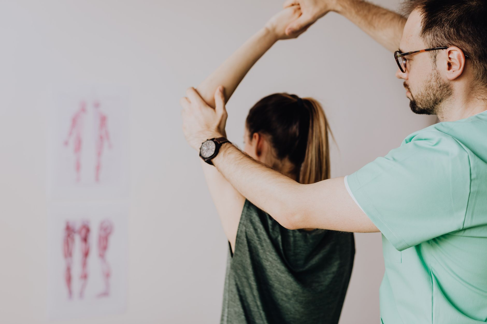

Passar a maior parte do dia sentado — no trabalho, no trajeto, em frente a telas — tornou-se a rotina da maioria das pessoas. O corpo, no entanto, não foi feito para ficar parado por longos períodos, e os efeitos do sedentarismo aparecem de forma silenciosa, muito antes de virarem dor.

## O que acontece com o corpo parado

Quando ficamos muito tempo na mesma posição, alguns grupos musculares enfraquecem por falta de uso — principalmente a musculatura glútea e o core — enquanto outros, como os flexores do quadril e a musculatura da região posterior do pescoço, tendem a encurtar. Esse desequilíbrio muda a forma como o corpo se movimenta mesmo fora do horário de trabalho, tornando gestos simples, como levantar do chão ou carregar uma sacola, menos eficientes.

As articulações também sentem: a falta de movimento reduz a produção de líquido sinovial, responsável por lubrificá-las, o que pode deixar a sensação de rigidez mais presente ao longo do dia.

## Sinais de que vale a pena prestar atenção

- Dor ou desconforto na lombar ao final do dia, mesmo sem esforço físico aparente.
- Sensação de "corpo travado" ao levantar após ficar muito tempo sentado.
- Cansaço muscular desproporcional em atividades simples, como subir escadas.
- Dificuldade de manter a postura ereta por períodos curtos.

## Como a fisioterapia entra nesse processo

Um fisioterapeuta não atua apenas depois que a dor aparece. A avaliação identifica quais grupos musculares estão enfraquecidos, quais estão encurtados e como isso se reflete na postura e nos padrões de movimento da pessoa. A partir disso, o tratamento costuma combinar:

1. **Liberação e alongamento** das estruturas encurtadas pelo tempo sentado.
2. **Fortalecimento direcionado** dos músculos que perderam ativação, especialmente glúteos e core.
3. **Orientação de pausas ativas** — pequenas quebras de movimento ao longo do dia, que fazem mais diferença do que uma única sessão de exercício intenso.

## Pequenas mudanças, resultado consistente

Não é preciso abandonar o trabalho sentado para reverter os efeitos do sedentarismo — é preciso introduzir movimento de forma consistente ao longo do dia. Alternar posições, levantar a cada intervalo e manter uma rotina de fortalecimento orientada já reduz boa parte da sobrecarga que o corpo acumula silenciosamente.

---

_Este artigo tem fins informativos. Os sinais de desconforto variam de pessoa para pessoa, e uma avaliação fisioterapêutica é o caminho mais seguro para saber o que o seu corpo precisa._
