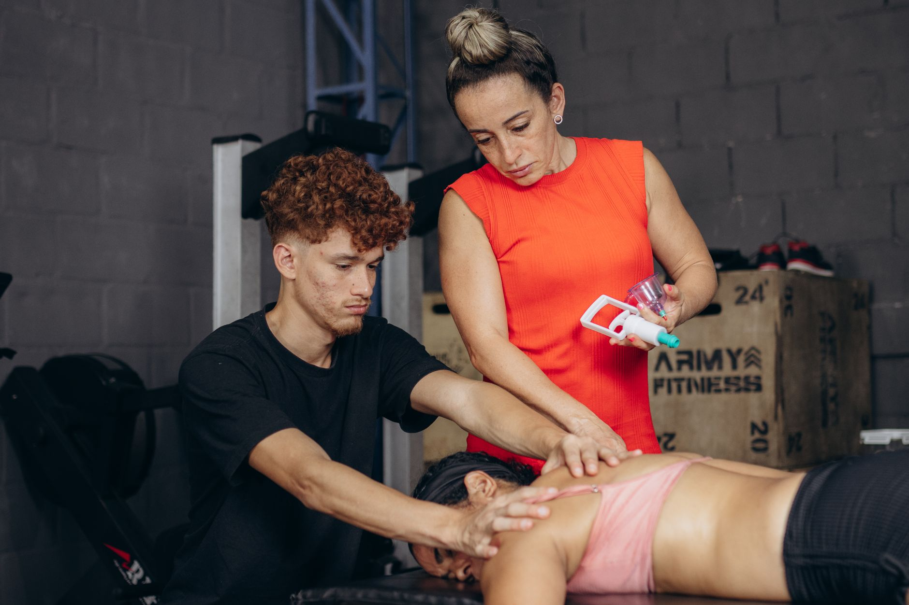

O "ombro do nadador" é um dos apelidos mais conhecidos para a tendinite do manguito rotador em atletas de natação — e não é à toa. O ombro é a articulação mais exigida nesse esporte, repetindo o mesmo movimento milhares de vezes em um único treino, o que o torna especialmente vulnerável a lesões por sobrecarga.

## Por que a natação sobrecarrega tanto o ombro

O gesto da braçada exige uma combinação de mobilidade e estabilidade que poucas outras atividades exigem: o ombro precisa girar em amplitudes extremas enquanto sustenta o corpo na água, milhares de vezes por semana. Quando a musculatura estabilizadora não acompanha esse volume de trabalho, os tendões do manguito rotador acabam sobrecarregados, gerando inflamação e dor.

Fatores como técnica inadequada, aumento brusco de volume de treino e desequilíbrios musculares entre os rotadores internos e externos do ombro costumam aumentar ainda mais esse risco.

## Sinais de alerta que merecem atenção

Vale procurar avaliação fisioterapêutica quando aparecem sinais como:

- Dor ao levantar o braço acima da cabeça, especialmente na fase de recuperação da braçada.
- Desconforto que piora ao longo do treino e não melhora com o aquecimento.
- Sensação de fraqueza ou fadiga precoce no ombro durante as séries.

Ignorar esses sinais tende a agravar o quadro, podendo evoluir para lesões mais complexas do manguito rotador.

## Como a fisioterapia atua

O tratamento costuma combinar controle da dor e inflamação na fase aguda com um trabalho progressivo de fortalecimento da musculatura estabilizadora da escápula e dos rotadores do ombro. Ajustes técnicos na braçada, feitos em conjunto com o técnico do nadador, também costumam fazer parte do plano, já que erros de padrão de movimento tendem a manter a sobrecarga mesmo depois da dor melhorar.

## Prevenção: o que reduz o risco

Um trabalho preventivo simples, com exercícios de fortalecimento de manguito rotador e estabilidade escapular, feito duas a três vezes por semana, ajuda a preparar o ombro para o volume de treino. Progressão gradual de carga e atenção à técnica também são pilares importantes para manter o ombro saudável ao longo de uma temporada de treinos.

---

_Este texto tem caráter informativo. Dores persistentes no ombro merecem avaliação individual com um fisioterapeuta antes de qualquer decisão sobre continuar ou pausar os treinos._
